# Исследование  метрик сервиса Яндекс.Афиша

В целях корректировки рекламного бюджета проводится когортный анализ клиентов сервиса, расчет маркетинговых, продуктовых и метрик электронной коммерции в разрезе когорт

Исследование проводится на основании данных Яндекс.Афиши с июня 2017 по конец мая 2018 года (dataset: лог сервера с данными о посещениях сайта Яндекс.Афиши; заказы за этот период; статистика рекламных расходов).

### Оглавление <a name='step_0'></a>
[1. Загрузка и предобработка данных](#step_1)    
    [1.1. Данные о визитах на сайт/сервис](#step_1.1)  
    [1.2. Данные о заказах](#step_1.2)  
    [1.3. Данные о рекламных расходах](#step_1.3)  
[2. Расчет метрик](#step_2)  
    [ 2.1. Продуктовые метрики (на основании данных визитов)](#step_2.1)  
        [2.1.1. DAU, WAU, MAU  и их изменение во времениих](#step_2.1.1)  
            [2.1.1.1. DAU](#step_2.1.1.1)  
            [2.1.1.2. WAU](#step_2.1.1.2)  
            [2.1.1.3. MAU](#step_2.1.1.3)  
            [2.1.1.4. Графики изменение DAU, WAU и  MAU во времени](#step_2.1.1.4)  
        [Выводы  по 2.1.1.](#step_2.1.1v)  
        [2.1.2.  Количество заходов пользователей за день на сайт (среднее и изменение во времени)](#step_2.1.2)  
            [2.1.2.1.  На основании метрики DAU](#step_2.1.2.1)  
            [2.1.2.2.  Анализ на основании MAU](#step_2.1.2.2)  
            [2.1.2.3.  Анализ за весь период](#step_2.1.2.3)  
        [Выводы  по 2.1.2.](#step_2.1.2v)  
        [2.1.3.  Продолжительность сессии пользователей на сайте (ASL и распределение по пользователям)](#step_2.1.3)  
        [Выводы  по 2.1.3.](#step_2.1.3v)  
        [2.1.4.  Рассчет Retention Rate](#step_2.1.4)  
        [Выводы  по 2.1.4.](#step_2.1.4v)  
    [2.2.  Метрики электронной коммерции (на основании данных заказов)](#step_2.2)  
        [2.2.1.  Исследование среднего времени с момента первого посещения сайта до покупки](#step_2.2.1)  
        [Выводы по  2.2.1.](#step_2.2.1v)  
        [2.2.2.  Расчет среднего количества покупок на одного клиента за период](#step_2.2.2)  
        [Выводы по  2.2.2.](#step_2.2.2v)  
        [2.2.3.  Расчет средней выручки с пользователя (изучение динамики метрики во времени)](#step_2.2.3)  
            [2.2.3.1.  Расчет в рамках когорт](#step_2.2.3.1)  
            [2.2.3.2.  Без деления на когорты](#step_2.2.3.2)  
        [Выводы по  2.2.3.](#step_2.2.3v)  
        [2.2.4.  Анализ накопительного LTV по когортам во времени](#step_2.2.4)  
        [Выводы по  2.2.4.](#step_2.2.4v)  
    [2.3.  Маркетинговые метрики](#step_2.3)  
        [2.3.1. Общая сумма расходов на маркетинг,  распределение расходов по источникам,  изменение распределения во времени](#step_2.3.1)  
        [Выводы по  2.3.1.](#step_2.3.1v)  
        [2.3.2.  CAC](#step_2.3.2)  
        [Выводы по  2.3.2.](#step_2.3.2v)  
        [2.3.3.  ROMI по когортам в разрезе источников](#step_2.3.3)  
        [Выводы по  2.3.3.](#step_2.3.3v)  
        [2.3.4. Анализ заказов пользователей в разрезе устройств и платформ](#step_2.3.4)  
[Общие выводы по исследованию](#step_fin)

## 1. Загрузка и предобработка данных<a name='step_1'></a>


```python
import pandas as pd
import numpy as np
import matplotlib.pyplot as plt
import seaborn as sns
import warnings


warnings.filterwarnings('ignore')
```


```python
df_v = pd.read_csv('visits_log.csv')
df_o = pd.read_csv('orders_log.csv')
df_c = pd.read_csv('costs.csv')
```

### 1.1. Данные о визитах на сайт/сервис<a name='step_1.1'></a>


```python
df_v.head()
```


<div>
<style scoped>
    .dataframe tbody tr th:only-of-type {
        vertical-align: middle;
    }

    .dataframe tbody tr th {
        vertical-align: top;
    }

    .dataframe thead th {
        text-align: right;
    }
</style>
<table border="1" class="dataframe">
  <thead>
    <tr style="text-align: right;">
      <th></th>
      <th>Device</th>
      <th>End Ts</th>
      <th>Source Id</th>
      <th>Start Ts</th>
      <th>Uid</th>
    </tr>
  </thead>
  <tbody>
    <tr>
      <th>0</th>
      <td>touch</td>
      <td>2017-12-20 17:38:00</td>
      <td>4</td>
      <td>2017-12-20 17:20:00</td>
      <td>16879256277535980062</td>
    </tr>
    <tr>
      <th>1</th>
      <td>desktop</td>
      <td>2018-02-19 17:21:00</td>
      <td>2</td>
      <td>2018-02-19 16:53:00</td>
      <td>104060357244891740</td>
    </tr>
    <tr>
      <th>2</th>
      <td>touch</td>
      <td>2017-07-01 01:54:00</td>
      <td>5</td>
      <td>2017-07-01 01:54:00</td>
      <td>7459035603376831527</td>
    </tr>
    <tr>
      <th>3</th>
      <td>desktop</td>
      <td>2018-05-20 11:23:00</td>
      <td>9</td>
      <td>2018-05-20 10:59:00</td>
      <td>16174680259334210214</td>
    </tr>
    <tr>
      <th>4</th>
      <td>desktop</td>
      <td>2017-12-27 14:06:00</td>
      <td>3</td>
      <td>2017-12-27 14:06:00</td>
      <td>9969694820036681168</td>
    </tr>
  </tbody>
</table>
</div>


```python
df_v.info()
```

    <class 'pandas.core.frame.DataFrame'>
    RangeIndex: 359400 entries, 0 to 359399
    Data columns (total 5 columns):
     #   Column     Non-Null Count   Dtype 
    ---  ------     --------------   ----- 
     0   Device     359400 non-null  object
     1   End Ts     359400 non-null  object
     2   Source Id  359400 non-null  int64 
     3   Start Ts   359400 non-null  object
     4   Uid        359400 non-null  uint64
    dtypes: int64(1), object(3), uint64(1)
    memory usage: 13.7+ MB


```python
# определение уникальных типов устройств
device_list = df_v['Device'].unique().tolist()
device_list
```


    ['touch', 'desktop']


```python
# проверка наличия полных дубликатов строк
df_v.duplicated().sum()
```


    0


#### В данных о визитах требуется: 
* замена наименования столбцов (приведение к нижнему регистру и замена пробелов на нижнее подчеркивание);  
* преобразование типа столбцов `End Ts` и `Start Ts` к типу `datetime`.


```python
df_v.columns =[col.lower().replace(' ', '_') for col in df_v.columns.to_list()]
df_v['end_ts'] = pd.to_datetime(df_v['end_ts'])
df_v['start_ts'] = pd.to_datetime(df_v['start_ts'])
df_v.info()
```

    <class 'pandas.core.frame.DataFrame'>
    RangeIndex: 359400 entries, 0 to 359399
    Data columns (total 5 columns):
     #   Column     Non-Null Count   Dtype         
    ---  ------     --------------   -----         
     0   device     359400 non-null  object        
     1   end_ts     359400 non-null  datetime64[ns]
     2   source_id  359400 non-null  int64         
     3   start_ts   359400 non-null  datetime64[ns]
     4   uid        359400 non-null  uint64        
    dtypes: datetime64[ns](2), int64(1), object(1), uint64(1)
    memory usage: 13.7+ MB


```python
# проверка диапазона дат (01.06.2017 - 31.05.2018 гг)
df_v['start_ts'].describe()
```


    count                  359400
    unique                 224303
    top       2017-11-24 16:06:00
    freq                       19
    first     2017-06-01 00:01:00
    last      2018-05-31 23:59:00
    Name: start_ts, dtype: object


### 1.2. Данные о заказах<a name='step_1.2'></a>


```python
df_o.head()
```


<div>
<style scoped>
    .dataframe tbody tr th:only-of-type {
        vertical-align: middle;
    }

    .dataframe tbody tr th {
        vertical-align: top;
    }

    .dataframe thead th {
        text-align: right;
    }
</style>
<table border="1" class="dataframe">
  <thead>
    <tr style="text-align: right;">
      <th></th>
      <th>Buy Ts</th>
      <th>Revenue</th>
      <th>Uid</th>
    </tr>
  </thead>
  <tbody>
    <tr>
      <th>0</th>
      <td>2017-06-01 00:10:00</td>
      <td>17.00</td>
      <td>10329302124590727494</td>
    </tr>
    <tr>
      <th>1</th>
      <td>2017-06-01 00:25:00</td>
      <td>0.55</td>
      <td>11627257723692907447</td>
    </tr>
    <tr>
      <th>2</th>
      <td>2017-06-01 00:27:00</td>
      <td>0.37</td>
      <td>17903680561304213844</td>
    </tr>
    <tr>
      <th>3</th>
      <td>2017-06-01 00:29:00</td>
      <td>0.55</td>
      <td>16109239769442553005</td>
    </tr>
    <tr>
      <th>4</th>
      <td>2017-06-01 07:58:00</td>
      <td>0.37</td>
      <td>14200605875248379450</td>
    </tr>
  </tbody>
</table>
</div>


```python
df_o.info()
```

    <class 'pandas.core.frame.DataFrame'>
    RangeIndex: 50415 entries, 0 to 50414
    Data columns (total 3 columns):
     #   Column   Non-Null Count  Dtype  
    ---  ------   --------------  -----  
     0   Buy Ts   50415 non-null  object 
     1   Revenue  50415 non-null  float64
     2   Uid      50415 non-null  uint64 
    dtypes: float64(1), object(1), uint64(1)
    memory usage: 1.2+ MB


```python
# проверка наличия полных дубликатов строк
df_o.duplicated().sum()
```


    0


#### В данных о заказах требуется: 
* замена наименования столбцов (приведение к нижнему регистру и замена пробелов на нижнее подчеркивание);  
* преобразование типа столбца `Buy Ts` к типу `datetime`.


```python
df_o.columns =[col.lower().replace(' ', '_') for col in df_o.columns.to_list()]
df_o['buy_ts'] = pd.to_datetime(df_o['buy_ts'])
df_o.info()
```

    <class 'pandas.core.frame.DataFrame'>
    RangeIndex: 50415 entries, 0 to 50414
    Data columns (total 3 columns):
     #   Column   Non-Null Count  Dtype         
    ---  ------   --------------  -----         
     0   buy_ts   50415 non-null  datetime64[ns]
     1   revenue  50415 non-null  float64       
     2   uid      50415 non-null  uint64        
    dtypes: datetime64[ns](1), float64(1), uint64(1)
    memory usage: 1.2 MB


```python
# проверка диапазона дат (01.06.2017 - 31.05.2018 гг)
df_o['buy_ts'].describe()
```


    count                   50415
    unique                  45991
    top       2018-05-31 10:13:00
    freq                        9
    first     2017-06-01 00:10:00
    last      2018-06-01 00:02:00
    Name: buy_ts, dtype: object


```python
# исключение строк с датой больше или равно 2018-06-01 00:00:00
df_o = df_o[df_o['buy_ts'] < '2018-06-01 00:00:00']
df_o['buy_ts'].describe()
```


    count                   50414
    unique                  45990
    top       2018-05-31 10:13:00
    freq                        9
    first     2017-06-01 00:10:00
    last      2018-05-31 23:56:00
    Name: buy_ts, dtype: object


### 1.3. Данные о рекламных расходах<a name='step_1.3'></a>


```python
df_c.head()
```


<div>
<style scoped>
    .dataframe tbody tr th:only-of-type {
        vertical-align: middle;
    }

    .dataframe tbody tr th {
        vertical-align: top;
    }

    .dataframe thead th {
        text-align: right;
    }
</style>
<table border="1" class="dataframe">
  <thead>
    <tr style="text-align: right;">
      <th></th>
      <th>source_id</th>
      <th>dt</th>
      <th>costs</th>
    </tr>
  </thead>
  <tbody>
    <tr>
      <th>0</th>
      <td>1</td>
      <td>2017-06-01</td>
      <td>75.20</td>
    </tr>
    <tr>
      <th>1</th>
      <td>1</td>
      <td>2017-06-02</td>
      <td>62.25</td>
    </tr>
    <tr>
      <th>2</th>
      <td>1</td>
      <td>2017-06-03</td>
      <td>36.53</td>
    </tr>
    <tr>
      <th>3</th>
      <td>1</td>
      <td>2017-06-04</td>
      <td>55.00</td>
    </tr>
    <tr>
      <th>4</th>
      <td>1</td>
      <td>2017-06-05</td>
      <td>57.08</td>
    </tr>
  </tbody>
</table>
</div>


```python
df_c.info()
```

    <class 'pandas.core.frame.DataFrame'>
    RangeIndex: 2542 entries, 0 to 2541
    Data columns (total 3 columns):
     #   Column     Non-Null Count  Dtype  
    ---  ------     --------------  -----  
     0   source_id  2542 non-null   int64  
     1   dt         2542 non-null   object 
     2   costs      2542 non-null   float64
    dtypes: float64(1), int64(1), object(1)
    memory usage: 59.7+ KB


```python
df_c.duplicated().sum()
```


    0


#### В данных о рекламных расходах: 
* преобразование типа столбца `dt` к типу `datetime`.


```python
df_c['dt'] = pd.to_datetime(df_c['dt'])
df_c.info()
```

    <class 'pandas.core.frame.DataFrame'>
    RangeIndex: 2542 entries, 0 to 2541
    Data columns (total 3 columns):
     #   Column     Non-Null Count  Dtype         
    ---  ------     --------------  -----         
     0   source_id  2542 non-null   int64         
     1   dt         2542 non-null   datetime64[ns]
     2   costs      2542 non-null   float64       
    dtypes: datetime64[ns](1), float64(1), int64(1)
    memory usage: 59.7 KB


```python
# проверка диапазона дат (01.06.2017 - 31.05.2018 гг)
df_c['dt'].describe()
```


    count                    2542
    unique                    364
    top       2017-06-28 00:00:00
    freq                        7
    first     2017-06-01 00:00:00
    last      2018-05-31 00:00:00
    Name: dt, dtype: object


## 2. Расчет метрик<a name='step_2'></a>

### 2.1. Продуктовые метрики (на основании данных визитов)<a name='step_2.1'></a>


```python
df_v.head(1)
```


<div>
<style scoped>
    .dataframe tbody tr th:only-of-type {
        vertical-align: middle;
    }

    .dataframe tbody tr th {
        vertical-align: top;
    }

    .dataframe thead th {
        text-align: right;
    }
</style>
<table border="1" class="dataframe">
  <thead>
    <tr style="text-align: right;">
      <th></th>
      <th>device</th>
      <th>end_ts</th>
      <th>source_id</th>
      <th>start_ts</th>
      <th>uid</th>
    </tr>
  </thead>
  <tbody>
    <tr>
      <th>0</th>
      <td>touch</td>
      <td>2017-12-20 17:38:00</td>
      <td>4</td>
      <td>2017-12-20 17:20:00</td>
      <td>16879256277535980062</td>
    </tr>
  </tbody>
</table>
</div>


```python
# добавление столбцов, соответвующих году, месяцу, недели, дню начала сессии пользователя
df_v['ses_m'] = df_v['start_ts'].dt.strftime('%Y-%m')
df_v['ses_w'] = df_v['start_ts'].dt.strftime('%y%W')
df_v['ses_d'] = df_v['start_ts'].dt.date
df_v['ses_m_dt'] = df_v['start_ts'].astype('datetime64[M]')
df_v.head()
```


<div>
<style scoped>
    .dataframe tbody tr th:only-of-type {
        vertical-align: middle;
    }

    .dataframe tbody tr th {
        vertical-align: top;
    }

    .dataframe thead th {
        text-align: right;
    }
</style>
<table border="1" class="dataframe">
  <thead>
    <tr style="text-align: right;">
      <th></th>
      <th>device</th>
      <th>end_ts</th>
      <th>source_id</th>
      <th>start_ts</th>
      <th>uid</th>
      <th>ses_m</th>
      <th>ses_w</th>
      <th>ses_d</th>
      <th>ses_m_dt</th>
    </tr>
  </thead>
  <tbody>
    <tr>
      <th>0</th>
      <td>touch</td>
      <td>2017-12-20 17:38:00</td>
      <td>4</td>
      <td>2017-12-20 17:20:00</td>
      <td>16879256277535980062</td>
      <td>2017-12</td>
      <td>1751</td>
      <td>2017-12-20</td>
      <td>2017-12-01</td>
    </tr>
    <tr>
      <th>1</th>
      <td>desktop</td>
      <td>2018-02-19 17:21:00</td>
      <td>2</td>
      <td>2018-02-19 16:53:00</td>
      <td>104060357244891740</td>
      <td>2018-02</td>
      <td>1808</td>
      <td>2018-02-19</td>
      <td>2018-02-01</td>
    </tr>
    <tr>
      <th>2</th>
      <td>touch</td>
      <td>2017-07-01 01:54:00</td>
      <td>5</td>
      <td>2017-07-01 01:54:00</td>
      <td>7459035603376831527</td>
      <td>2017-07</td>
      <td>1726</td>
      <td>2017-07-01</td>
      <td>2017-07-01</td>
    </tr>
    <tr>
      <th>3</th>
      <td>desktop</td>
      <td>2018-05-20 11:23:00</td>
      <td>9</td>
      <td>2018-05-20 10:59:00</td>
      <td>16174680259334210214</td>
      <td>2018-05</td>
      <td>1820</td>
      <td>2018-05-20</td>
      <td>2018-05-01</td>
    </tr>
    <tr>
      <th>4</th>
      <td>desktop</td>
      <td>2017-12-27 14:06:00</td>
      <td>3</td>
      <td>2017-12-27 14:06:00</td>
      <td>9969694820036681168</td>
      <td>2017-12</td>
      <td>1752</td>
      <td>2017-12-27</td>
      <td>2017-12-01</td>
    </tr>
  </tbody>
</table>
</div>


#### 2.1.1. DAU, WAU, MAU  и их изменение во времении<a name='step_2.1.1'></a>

##### 2.1.1.1. DAU<a name='step_2.1.1.1'></a>


```python
dau_all = df_v.groupby('ses_d').agg({'uid': ['count','nunique']}).reset_index()
dau_touch = df_v[df_v['device'] == 'touch'].groupby('ses_d').agg({'uid': ['count','nunique']}).reset_index()
dau_desktop = df_v[df_v['device'] == 'desktop'].groupby('ses_d').agg({'uid': ['count','nunique']}).reset_index()
dau_all.columns = ['ses_d', 'count_ses','count_un_users']
dau_touch.columns = ['ses_d', 'count_ses','count_un_users']
dau_desktop.columns = ['ses_d', 'count_ses','count_un_users']
```


```python
dau_all['count_un_users'].hist()
plt.title('Гистограмма значений DAU')
plt.ylabel('Частотность значения, шт')
plt.xlabel('Количество уникальных пользователей в день, шт.')
plt.show()
```


```python
dau_all['count_un_users'].describe()
```


    count     364.000000
    mean      907.991758
    std       370.513838
    min         1.000000
    25%       594.000000
    50%       921.000000
    75%      1173.000000
    max      3319.000000
    Name: count_un_users, dtype: float64


```python
# среднее значение и медиана имеют сопоставимые значения - в качестве "среднего" будем использовать среднее значение
dau_mean = int(round(dau_all['count_un_users'].mean(), 0))
dau_mean
```


    908


##### 2.1.1.2. WAU<a name='step_2.1.1.2'></a>


```python
wau_all = df_v.groupby('ses_w').agg({'uid': 'nunique'}).reset_index()
wau_touch = df_v[df_v['device'] == 'touch'].groupby('ses_w').agg({'uid': 'nunique'}).reset_index()
wau_desktop = df_v[df_v['device'] == 'desktop'].groupby('ses_w').agg({'uid': 'nunique'}).reset_index()
wau_touch.columns = ['ses_w','count_un_users']
wau_all.columns = ['ses_w','count_un_users']
wau_desktop.columns = ['ses_w','count_un_users']
```


```python
wau_all['count_un_users'].hist()
plt.title('Гистограмма значений WAU')
plt.ylabel('Частотность значения, шт')
plt.xlabel('Количество уникальных пользователей в неделю, шт.')
plt.show()
```


```python
wau_all['count_un_users'].describe()
```


    count       53.000000
    mean      5716.245283
    std       2049.898027
    min       2021.000000
    25%       4128.000000
    50%       5740.000000
    75%       7401.000000
    max      10586.000000
    Name: count_un_users, dtype: float64


```python
# среднее значение и медиана имеют сопоставимые значения  - в качестве "среднего" будем использовать среднее значение
wau_mean = int(round(wau_all['count_un_users'].mean(), 0))
wau_mean
```


    5716


##### 2.1.1.3. MAU<a name='step_2.1.1.3'></a>


```python
mau_all = df_v.groupby('ses_m').agg({'uid': ['count','nunique']}).reset_index()
mau_touch = df_v[df_v['device'] == 'touch'].groupby('ses_m').agg({'uid': ['count','nunique']}).reset_index()
mau_desktop = df_v[df_v['device'] == 'desktop'].groupby('ses_m').agg({'uid': ['count','nunique']}).reset_index()
mau_all.columns = ['ses_m', 'count_ses', 'count_un_users']
mau_touch.columns = ['ses_m', 'count_ses', 'count_un_users']
mau_desktop.columns = ['ses_m', 'count_ses', 'count_un_users']
```


```python
mau_all['count_un_users'].hist()
plt.title('Гистограмма значений MAU')
plt.ylabel('Частотность значения, шт')
plt.xlabel('Количество уникальных пользователей в месяц, шт.')
plt.show()
```


```python
mau_all['count_un_users'].describe()
```


    count       12.000000
    mean     23228.416667
    std       7546.380462
    min      11631.000000
    25%      17777.000000
    50%      24240.500000
    75%      28984.750000
    max      32797.000000
    Name: count_un_users, dtype: float64


```python
# среднее значение и медиана имеют сопоставимые значения  - в качестве "среднего" будем использовать среднее значение
mau_mean = int(round(mau_all['count_un_users'].mean(), 0))
mau_mean
```


    23228


##### 2.1.1.4.  Графики изменение DAU, WAU и  MAU во времени <a name='step_2.1.1.4'></a>


```python
plt.figure(figsize=(12,4), dpi=200)
sns.lineplot(x='ses_d', y='count_un_users', data=dau_all, label='DAU все устройства')
sns.lineplot(x='ses_d', y='count_un_users', data=dau_desktop, label='DAU desktop')
sns.lineplot(x='ses_d', y='count_un_users', data=dau_touch, label='DAU touch')
plt.title('График изменения DAU по времени')
plt.xlabel('Дни')
plt.ylabel('Кол. уник. пользоват. в день, шт.')
plt.xticks(ticks=mau_all['ses_m'], rotation=45)
plt.show()
```


```python
plt.figure(figsize=(12,4), dpi=200)
sns.lineplot(x='ses_w', y='count_un_users', data=wau_all, label='WAU все устройства')
sns.lineplot(x='ses_w', y='count_un_users', data=wau_desktop, label='WAU desktop')
sns.lineplot(x='ses_w', y='count_un_users', data=wau_touch, label='WAU touch')
plt.title('График изменения WAU по времени')
plt.xlabel('Недели')
plt.ylabel('Кол. уник. пользоват. в неделю, шт.')
plt.xticks( rotation=90)
plt.show()
```


```python
device_list
```


    ['touch', 'desktop']


```python
plt.figure(figsize=(12,4), dpi=200)
sns.lineplot(x='ses_m', y='count_un_users', data=mau_all, label='MAU все устройства')
sns.lineplot(x='ses_m', y='count_un_users', data=mau_desktop, label='MAU desktop')
sns.lineplot(x='ses_m', y='count_un_users', data=mau_touch, label='MAU touch')
plt.title('График изменемния MAU по времени')
plt.xlabel('Месяцы')
plt.ylabel('Кол. уник. пользоват. в день, шт.')
plt.xticks(ticks=mau_all['ses_m'], rotation=45)
plt.show()
```


#### Выводы  по 2.1.1.<a name='step_2.1.1v'></a>
1. Cредние значения метрик по всем платформам за весь период (01.06.2017 - 31.05.2018 гг):  
DAU = 908  
WAU = 5_716  
MAU = 23_228   
Средние значения метрик не соответствуют математическому произведению одних из метрик на соответсвующие константы (количество дней в месяце, количество недель в месяце), что ожидаемо и не является аномалией. 

2. График MAU показывает наличие сезонности в использованинии услуги пользователями: летом активность минимальна, с увеличением в осенние месяцы и пиков в ноябре, затем наблюдается снижение активности (однако представлый период данных не позволяет проанализировать сезонность "год к году"). При этом, на платформе touch сезонность в осенне-весенний период отсутствут, по сравнению с сезонностью decktop пользователей.  
3. График WAU отражает общию тенденцию графика MAU, при этом, показывет наличие в рамках одного месяца разнонаправленные движения, направление которых может не соответствовать тренду месячного графика. А для различных платформ наблюдается в реде периодов разнонаправленная тенденция в одни и теже недели.  
4. График DAU свидетельствует о распределении в с двумя пиками в течении недели. т.е. в рамках недели наблюдается некоторая повторяющаяся "сезонность" по дням (для более подробных вывовдом по недельному распределению требуется дополнительное исследование). При делении на платформы распределение с двумя пиками характерно для decktop пользователей, а пользователи touch проказывают другую форму распределения (в большинстве случаем противоположно направленную по сравнению с deckop пользователям), кроме того недельная сезонность для touch пользователей не так выражена.

*Таким образом, наблюдается различия в между платформами пользователей:*
* в первую очередь в количестве
* во вторую очередь в характере изменения показателя во времени.

#### 2.1.2.  Количество заходов пользователей за день на сайт (среднее и изменение во времени)<a name='step_2.1.2'></a>

##### 2.1.2.1.  На основании метрики DAU<a name='step_2.1.2.1'></a>


```python
dau_all.head()
```


<div>
<style scoped>
    .dataframe tbody tr th:only-of-type {
        vertical-align: middle;
    }

    .dataframe tbody tr th {
        vertical-align: top;
    }

    .dataframe thead th {
        text-align: right;
    }
</style>
<table border="1" class="dataframe">
  <thead>
    <tr style="text-align: right;">
      <th></th>
      <th>ses_d</th>
      <th>count_ses</th>
      <th>count_un_users</th>
    </tr>
  </thead>
  <tbody>
    <tr>
      <th>0</th>
      <td>2017-06-01</td>
      <td>664</td>
      <td>605</td>
    </tr>
    <tr>
      <th>1</th>
      <td>2017-06-02</td>
      <td>658</td>
      <td>608</td>
    </tr>
    <tr>
      <th>2</th>
      <td>2017-06-03</td>
      <td>477</td>
      <td>445</td>
    </tr>
    <tr>
      <th>3</th>
      <td>2017-06-04</td>
      <td>510</td>
      <td>476</td>
    </tr>
    <tr>
      <th>4</th>
      <td>2017-06-05</td>
      <td>893</td>
      <td>820</td>
    </tr>
  </tbody>
</table>
</div>


```python
# добавление столбца с количеством заходов на сайт пользователей
dau_all['cnt_ses_per_user_d'] = round(dau_all['count_ses'] / dau_all['count_un_users'], 2)
dau_all.head(10)
```


<div>
<style scoped>
    .dataframe tbody tr th:only-of-type {
        vertical-align: middle;
    }

    .dataframe tbody tr th {
        vertical-align: top;
    }

    .dataframe thead th {
        text-align: right;
    }
</style>
<table border="1" class="dataframe">
  <thead>
    <tr style="text-align: right;">
      <th></th>
      <th>ses_d</th>
      <th>count_ses</th>
      <th>count_un_users</th>
      <th>cnt_ses_per_user_d</th>
    </tr>
  </thead>
  <tbody>
    <tr>
      <th>0</th>
      <td>2017-06-01</td>
      <td>664</td>
      <td>605</td>
      <td>1.10</td>
    </tr>
    <tr>
      <th>1</th>
      <td>2017-06-02</td>
      <td>658</td>
      <td>608</td>
      <td>1.08</td>
    </tr>
    <tr>
      <th>2</th>
      <td>2017-06-03</td>
      <td>477</td>
      <td>445</td>
      <td>1.07</td>
    </tr>
    <tr>
      <th>3</th>
      <td>2017-06-04</td>
      <td>510</td>
      <td>476</td>
      <td>1.07</td>
    </tr>
    <tr>
      <th>4</th>
      <td>2017-06-05</td>
      <td>893</td>
      <td>820</td>
      <td>1.09</td>
    </tr>
    <tr>
      <th>5</th>
      <td>2017-06-06</td>
      <td>875</td>
      <td>797</td>
      <td>1.10</td>
    </tr>
    <tr>
      <th>6</th>
      <td>2017-06-07</td>
      <td>788</td>
      <td>699</td>
      <td>1.13</td>
    </tr>
    <tr>
      <th>7</th>
      <td>2017-06-08</td>
      <td>939</td>
      <td>868</td>
      <td>1.08</td>
    </tr>
    <tr>
      <th>8</th>
      <td>2017-06-09</td>
      <td>755</td>
      <td>695</td>
      <td>1.09</td>
    </tr>
    <tr>
      <th>9</th>
      <td>2017-06-10</td>
      <td>375</td>
      <td>350</td>
      <td>1.07</td>
    </tr>
  </tbody>
</table>
</div>


```python
dau_all['cnt_ses_per_user_d'].hist()
plt.title('Гистограмма заходов пользователей на сайт в день')
plt.ylabel('Частотность значения, шт')
plt.xlabel('Среднее количество заходов на сайт одного пользователя, шт.')
plt.show()
```


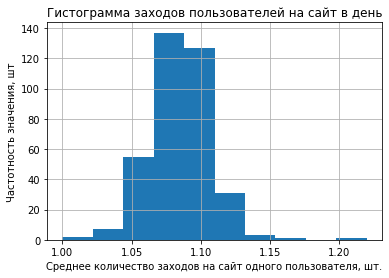


```python
dau_all['cnt_ses_per_user_d'].describe()
```


    count    364.000000
    mean       1.082390
    std        0.021321
    min        1.000000
    25%        1.070000
    50%        1.080000
    75%        1.090000
    max        1.220000
    Name: cnt_ses_per_user_d, dtype: float64


```python
cnt_ses_per_user_d_mean = round(dau_all['cnt_ses_per_user_d'].mean(), 2)
print(cnt_ses_per_user_d_mean)
```

    1.08


```python
plt.figure(figsize=(12,4), dpi=200)
sns.lineplot(x='ses_d', y='cnt_ses_per_user_d', data=dau_all, label='Количество сессий на пользователя в день')
plt.title('График изменения количества сессий на пользователя в день')
plt.xlabel('Дни')
plt.ylabel('Кол. сессий на пользователя, шт.')
plt.xticks(ticks=mau_all['ses_m'], rotation=45)
plt.axhline(cnt_ses_per_user_d_mean, ls='--', c='r', label='Среднее кол.сессий на польз. в день за период')
plt.legend()
plt.show()
```


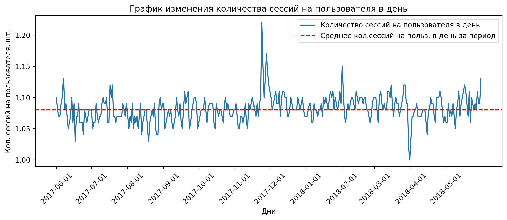


##### 2.1.2.2.  Анализ на основании MAU<a name='step_2.1.2.2'></a>


```python
mau_all['cnt_ses_per_user_m'] = round(mau_all['count_ses'] / mau_all['count_un_users'], 2)
mau_all.head()
```


<div>
<style scoped>
    .dataframe tbody tr th:only-of-type {
        vertical-align: middle;
    }

    .dataframe tbody tr th {
        vertical-align: top;
    }

    .dataframe thead th {
        text-align: right;
    }
</style>
<table border="1" class="dataframe">
  <thead>
    <tr style="text-align: right;">
      <th></th>
      <th>ses_m</th>
      <th>count_ses</th>
      <th>count_un_users</th>
      <th>cnt_ses_per_user_m</th>
    </tr>
  </thead>
  <tbody>
    <tr>
      <th>0</th>
      <td>2017-06</td>
      <td>16505</td>
      <td>13259</td>
      <td>1.24</td>
    </tr>
    <tr>
      <th>1</th>
      <td>2017-07</td>
      <td>17828</td>
      <td>14183</td>
      <td>1.26</td>
    </tr>
    <tr>
      <th>2</th>
      <td>2017-08</td>
      <td>14355</td>
      <td>11631</td>
      <td>1.23</td>
    </tr>
    <tr>
      <th>3</th>
      <td>2017-09</td>
      <td>23907</td>
      <td>18975</td>
      <td>1.26</td>
    </tr>
    <tr>
      <th>4</th>
      <td>2017-10</td>
      <td>37903</td>
      <td>29692</td>
      <td>1.28</td>
    </tr>
  </tbody>
</table>
</div>


```python
# гистограмма распределения значений 
mau_all['cnt_ses_per_user_m'].hist()
plt.title('Гистограмма заходов пользователей на сайт в месяц')
plt.ylabel('Частотность значения, шт')
plt.xlabel('Среднее количество заходов на сайт одного пользователя, шт.')
plt.show()
```


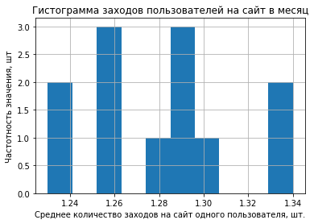


```python
# расчет среднего значения сессий на одного пользователя за месяц
cnt_ses_per_user_m_mean = round(mau_all['cnt_ses_per_user_m'].mean(), 2)
cnt_ses_per_user_m_mean
```


    1.28


##### 2.1.2.3.  Анализ за весь период<a name='step_2.1.2.3'></a>


```python
# подсчет количества сессий и уникальных пользователей за весь период
pau_all = df_v.agg({'uid': ['count', 'nunique']}).T.reset_index(drop=True)
pau_all
```


<div>
<style scoped>
    .dataframe tbody tr th:only-of-type {
        vertical-align: middle;
    }

    .dataframe tbody tr th {
        vertical-align: top;
    }

    .dataframe thead th {
        text-align: right;
    }
</style>
<table border="1" class="dataframe">
  <thead>
    <tr style="text-align: right;">
      <th></th>
      <th>count</th>
      <th>nunique</th>
    </tr>
  </thead>
  <tbody>
    <tr>
      <th>0</th>
      <td>359400</td>
      <td>228169</td>
    </tr>
  </tbody>
</table>
</div>


```python
# определение количества месяцев в рассматриваемом периоде
pau_all['count_month'] = len(mau_all)
pau_all
```


<div>
<style scoped>
    .dataframe tbody tr th:only-of-type {
        vertical-align: middle;
    }

    .dataframe tbody tr th {
        vertical-align: top;
    }

    .dataframe thead th {
        text-align: right;
    }
</style>
<table border="1" class="dataframe">
  <thead>
    <tr style="text-align: right;">
      <th></th>
      <th>count</th>
      <th>nunique</th>
      <th>count_month</th>
    </tr>
  </thead>
  <tbody>
    <tr>
      <th>0</th>
      <td>359400</td>
      <td>228169</td>
      <td>12</td>
    </tr>
  </tbody>
</table>
</div>


```python
# расчет среднего значения сессий на  одного пользователя за весь период
pau_all['cnt_ses_per_user_y'] = round(pau_all['count'] / pau_all['nunique'], 2)
pau_all
```


<div>
<style scoped>
    .dataframe tbody tr th:only-of-type {
        vertical-align: middle;
    }

    .dataframe tbody tr th {
        vertical-align: top;
    }

    .dataframe thead th {
        text-align: right;
    }
</style>
<table border="1" class="dataframe">
  <thead>
    <tr style="text-align: right;">
      <th></th>
      <th>count</th>
      <th>nunique</th>
      <th>count_month</th>
      <th>cnt_ses_per_user_y</th>
    </tr>
  </thead>
  <tbody>
    <tr>
      <th>0</th>
      <td>359400</td>
      <td>228169</td>
      <td>12</td>
      <td>1.58</td>
    </tr>
  </tbody>
</table>
</div>


#### Выводы  по 2.1.2.  <a name='step_2.1.2v'></a>
В среднем пользователи заходят на сайт 1.08 раз в день. Т.е. пользователь в среднем заходит на сайт только 1 раз в день.  
Данный показатель достаточно стабилен на протежении всего периода исследования - наблюдаются небольшие отклонения в ту или другую сторону и есть один всплеск в конце ноября и одно падение показателя в марте-апреле (рассмотрение причин падения в данном исследовании не производится).  

При этом, дополнительные исследования показали , что в течении месяца пользователь заходит на сайт только 1.28 раз, а за весь исследуемый период пользователи в среднем заходили только 1.58 раз.  

Таким образом, трафик заходов на сайт обеспечивается в основном за счет новых пользователей (более подробно когортный анализ будет рассмотрен в следующих разделах исследования) 

#### 2.1.3  Продолжительность сессии пользователей на сайте (ASL и распределение по пользователям)<a name='step_2.1.3'></a>


```python
df_v['ses_duration_sec'] = (df_v['end_ts'] - df_v['start_ts']).dt.seconds
df_v.head()
```


<div>
<style scoped>
    .dataframe tbody tr th:only-of-type {
        vertical-align: middle;
    }

    .dataframe tbody tr th {
        vertical-align: top;
    }

    .dataframe thead th {
        text-align: right;
    }
</style>
<table border="1" class="dataframe">
  <thead>
    <tr style="text-align: right;">
      <th></th>
      <th>device</th>
      <th>end_ts</th>
      <th>source_id</th>
      <th>start_ts</th>
      <th>uid</th>
      <th>ses_m</th>
      <th>ses_w</th>
      <th>ses_d</th>
      <th>ses_m_dt</th>
      <th>ses_duration_sec</th>
    </tr>
  </thead>
  <tbody>
    <tr>
      <th>0</th>
      <td>touch</td>
      <td>2017-12-20 17:38:00</td>
      <td>4</td>
      <td>2017-12-20 17:20:00</td>
      <td>16879256277535980062</td>
      <td>2017-12</td>
      <td>1751</td>
      <td>2017-12-20</td>
      <td>2017-12-01</td>
      <td>1080</td>
    </tr>
    <tr>
      <th>1</th>
      <td>desktop</td>
      <td>2018-02-19 17:21:00</td>
      <td>2</td>
      <td>2018-02-19 16:53:00</td>
      <td>104060357244891740</td>
      <td>2018-02</td>
      <td>1808</td>
      <td>2018-02-19</td>
      <td>2018-02-01</td>
      <td>1680</td>
    </tr>
    <tr>
      <th>2</th>
      <td>touch</td>
      <td>2017-07-01 01:54:00</td>
      <td>5</td>
      <td>2017-07-01 01:54:00</td>
      <td>7459035603376831527</td>
      <td>2017-07</td>
      <td>1726</td>
      <td>2017-07-01</td>
      <td>2017-07-01</td>
      <td>0</td>
    </tr>
    <tr>
      <th>3</th>
      <td>desktop</td>
      <td>2018-05-20 11:23:00</td>
      <td>9</td>
      <td>2018-05-20 10:59:00</td>
      <td>16174680259334210214</td>
      <td>2018-05</td>
      <td>1820</td>
      <td>2018-05-20</td>
      <td>2018-05-01</td>
      <td>1440</td>
    </tr>
    <tr>
      <th>4</th>
      <td>desktop</td>
      <td>2017-12-27 14:06:00</td>
      <td>3</td>
      <td>2017-12-27 14:06:00</td>
      <td>9969694820036681168</td>
      <td>2017-12</td>
      <td>1752</td>
      <td>2017-12-27</td>
      <td>2017-12-01</td>
      <td>0</td>
    </tr>
  </tbody>
</table>
</div>


```python
ses_duration_sec_mean = int(round(df_v['ses_duration_sec'].mean(), 0))
ses_duration_sec_mean
```


    644


```python
df_v['ses_duration_sec'].describe()
```


    count    359400.000000
    mean        643.506489
    std        1016.334786
    min           0.000000
    25%         120.000000
    50%         300.000000
    75%         840.000000
    max       84480.000000
    Name: ses_duration_sec, dtype: float64


```python
plt.figure(figsize=(12,4), dpi=200)
sns.distplot(df_v['ses_duration_sec'], bins=100, kde=False)
plt.title('Гистограмма всех сессий пользователей за весь период')
plt.xlabel('Длительность сессии пользователя, сек')
plt.ylabel('Частотность значения, шт.')
plt.show()
```


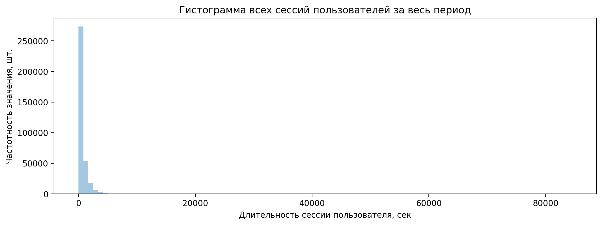


```python
# ящик с усами распределения длительности сессий
df_v[['ses_duration_sec']].boxplot()
plt.title('Boxplot (ящик с усами) длительности сессий пользователей')
plt.ylabel('Секунд')
plt.show()
```


* Распределение имеет длиный хвост, и редкие выбросы не позволяют отобразить распределение наиболее частных значений.  
* отсечем значения выходящие за верхний ус


```python
border_value = 1.5*(df_v['ses_duration_sec'].quantile(q=0.75) - df_v['ses_duration_sec'].quantile(q=0.25))
border_value
```


    1080.0


```python
df_v[['ses_duration_sec']].boxplot()
plt.ylim(0, border_value)
plt.title('Boxplot (ящик с усами) длительности сессий пользователей')
plt.ylabel('Секунд')
plt.show()
```


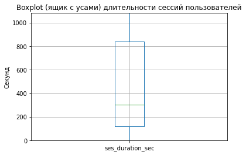


```python
plt.figure(figsize=(12,4), dpi=200)
sns.distplot(df_v['ses_duration_sec'],bins=3000, kde=False)
plt.title('Гистограмма всех сессий пользователей за весь период с ограничением по верхнему усу')
plt.xlim(0, border_value)
plt.ylabel('Частотность значения, шт')
plt.xlabel('Длительность сессии, сек.')
plt.show()
```


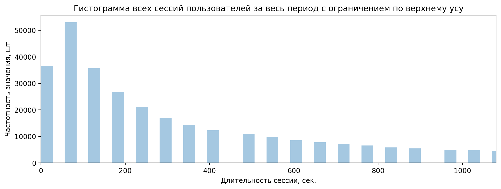


```python
# расчитаем моду распределения значений
print(df_v['ses_duration_sec'].mode())
```

    0    60
    dtype: int64


#### Выводы  по 2.1.3.    <a name='step_2.1.3v'></a>
Среднее значение mean() равно 644 сек и смещенно в право за счет длинного хвоста выбросов.
Мода равна 60 сек.  
Характер распределения гистограммы продолжительности сессий пользователей показывает, что в качестве "среднего" значения лучше использовать медиану - 300 сек. (5 мин.), как значение отражающее распределение данных.  
Таким образом, можно сделать вывод,  что пользователи в среднем проводят на сайте около 5 минут.  

#### 2.1.4.  Рассчет Retention Rate<a name='step_2.1.4'></a>


```python
# создание справочника с датой первой сессии пользователя в формате день, неделя, месяц
first_ses_date_by_users = df_v.groupby('uid').agg({'start_ts': 'min', })
first_ses_date_by_users.columns = ['first_ses_ts']
first_ses_date_by_users['first_ses_w'] = first_ses_date_by_users['first_ses_ts'].dt.strftime('%y%W').astype('int')
first_ses_date_by_users['first_ses_m'] = first_ses_date_by_users['first_ses_ts'].astype('datetime64[M]')
first_ses_date_by_users['first_ses_d'] = first_ses_date_by_users['first_ses_ts'].astype('datetime64[D]')
first_ses_date_by_users.sample(10)
```


<div>
<style scoped>
    .dataframe tbody tr th:only-of-type {
        vertical-align: middle;
    }

    .dataframe tbody tr th {
        vertical-align: top;
    }

    .dataframe thead th {
        text-align: right;
    }
</style>
<table border="1" class="dataframe">
  <thead>
    <tr style="text-align: right;">
      <th></th>
      <th>first_ses_ts</th>
      <th>first_ses_w</th>
      <th>first_ses_m</th>
      <th>first_ses_d</th>
    </tr>
    <tr>
      <th>uid</th>
      <th></th>
      <th></th>
      <th></th>
      <th></th>
    </tr>
  </thead>
  <tbody>
    <tr>
      <th>1993849925130844191</th>
      <td>2017-07-27 07:50:00</td>
      <td>1730</td>
      <td>2017-07-01</td>
      <td>2017-07-27</td>
    </tr>
    <tr>
      <th>14053861457921751166</th>
      <td>2018-01-02 16:09:00</td>
      <td>1801</td>
      <td>2018-01-01</td>
      <td>2018-01-02</td>
    </tr>
    <tr>
      <th>6036257610962254847</th>
      <td>2018-01-30 20:44:00</td>
      <td>1805</td>
      <td>2018-01-01</td>
      <td>2018-01-30</td>
    </tr>
    <tr>
      <th>9063221407336919836</th>
      <td>2018-01-26 10:28:00</td>
      <td>1804</td>
      <td>2018-01-01</td>
      <td>2018-01-26</td>
    </tr>
    <tr>
      <th>14885903719211391999</th>
      <td>2018-03-09 12:36:00</td>
      <td>1810</td>
      <td>2018-03-01</td>
      <td>2018-03-09</td>
    </tr>
    <tr>
      <th>2750218026677994903</th>
      <td>2018-01-14 22:05:00</td>
      <td>1802</td>
      <td>2018-01-01</td>
      <td>2018-01-14</td>
    </tr>
    <tr>
      <th>6937457169897799250</th>
      <td>2017-10-25 12:01:00</td>
      <td>1743</td>
      <td>2017-10-01</td>
      <td>2017-10-25</td>
    </tr>
    <tr>
      <th>14586841227707520484</th>
      <td>2018-05-29 10:46:00</td>
      <td>1822</td>
      <td>2018-05-01</td>
      <td>2018-05-29</td>
    </tr>
    <tr>
      <th>1824868361442509862</th>
      <td>2018-02-15 16:41:00</td>
      <td>1807</td>
      <td>2018-02-01</td>
      <td>2018-02-15</td>
    </tr>
    <tr>
      <th>16713995957767235712</th>
      <td>2018-04-11 09:52:00</td>
      <td>1815</td>
      <td>2018-04-01</td>
      <td>2018-04-11</td>
    </tr>
  </tbody>
</table>
</div>


```python
# добавление в исходные данные данных о первой сессии
df_v = df_v.join(first_ses_date_by_users, on='uid')
df_v.sample(5)
```


<div>
<style scoped>
    .dataframe tbody tr th:only-of-type {
        vertical-align: middle;
    }

    .dataframe tbody tr th {
        vertical-align: top;
    }

    .dataframe thead th {
        text-align: right;
    }
</style>
<table border="1" class="dataframe">
  <thead>
    <tr style="text-align: right;">
      <th></th>
      <th>device</th>
      <th>end_ts</th>
      <th>source_id</th>
      <th>start_ts</th>
      <th>uid</th>
      <th>ses_m</th>
      <th>ses_w</th>
      <th>ses_d</th>
      <th>ses_m_dt</th>
      <th>ses_duration_sec</th>
      <th>first_ses_ts</th>
      <th>first_ses_w</th>
      <th>first_ses_m</th>
      <th>first_ses_d</th>
    </tr>
  </thead>
  <tbody>
    <tr>
      <th>130940</th>
      <td>desktop</td>
      <td>2017-06-22 11:41:00</td>
      <td>3</td>
      <td>2017-06-22 11:40:00</td>
      <td>17001377395987163306</td>
      <td>2017-06</td>
      <td>1725</td>
      <td>2017-06-22</td>
      <td>2017-06-01</td>
      <td>60</td>
      <td>2017-06-21 23:02:00</td>
      <td>1725</td>
      <td>2017-06-01</td>
      <td>2017-06-21</td>
    </tr>
    <tr>
      <th>95452</th>
      <td>desktop</td>
      <td>2017-10-13 22:37:00</td>
      <td>4</td>
      <td>2017-10-13 22:34:00</td>
      <td>6136792377288841596</td>
      <td>2017-10</td>
      <td>1741</td>
      <td>2017-10-13</td>
      <td>2017-10-01</td>
      <td>180</td>
      <td>2017-10-13 22:34:00</td>
      <td>1741</td>
      <td>2017-10-01</td>
      <td>2017-10-13</td>
    </tr>
    <tr>
      <th>218971</th>
      <td>desktop</td>
      <td>2018-02-18 19:37:00</td>
      <td>3</td>
      <td>2018-02-18 19:36:00</td>
      <td>15034161419852325075</td>
      <td>2018-02</td>
      <td>1807</td>
      <td>2018-02-18</td>
      <td>2018-02-01</td>
      <td>60</td>
      <td>2018-02-18 19:36:00</td>
      <td>1807</td>
      <td>2018-02-01</td>
      <td>2018-02-18</td>
    </tr>
    <tr>
      <th>315643</th>
      <td>desktop</td>
      <td>2018-02-07 13:09:00</td>
      <td>3</td>
      <td>2018-02-07 13:08:00</td>
      <td>4159648151201563957</td>
      <td>2018-02</td>
      <td>1806</td>
      <td>2018-02-07</td>
      <td>2018-02-01</td>
      <td>60</td>
      <td>2018-02-07 10:59:00</td>
      <td>1806</td>
      <td>2018-02-01</td>
      <td>2018-02-07</td>
    </tr>
    <tr>
      <th>40048</th>
      <td>touch</td>
      <td>2017-09-21 13:12:00</td>
      <td>4</td>
      <td>2017-09-21 13:07:00</td>
      <td>16691800279720528833</td>
      <td>2017-09</td>
      <td>1738</td>
      <td>2017-09-21</td>
      <td>2017-09-01</td>
      <td>300</td>
      <td>2017-09-21 13:07:00</td>
      <td>1738</td>
      <td>2017-09-01</td>
      <td>2017-09-21</td>
    </tr>
  </tbody>
</table>
</div>


```python
# приведение поля ses_d к типу datetime (для вычисления lifetime когорты)
df_v['ses_d'] = df_v['ses_d'].astype('datetime64[D]')
```


```python
df_v['lifetime'] = round((df_v['ses_m_dt'] - df_v['first_ses_m']) / np.timedelta64(1, 'M'), 0).astype(int)
df_v.sample(5)
```


<div>
<style scoped>
    .dataframe tbody tr th:only-of-type {
        vertical-align: middle;
    }

    .dataframe tbody tr th {
        vertical-align: top;
    }

    .dataframe thead th {
        text-align: right;
    }
</style>
<table border="1" class="dataframe">
  <thead>
    <tr style="text-align: right;">
      <th></th>
      <th>device</th>
      <th>end_ts</th>
      <th>source_id</th>
      <th>start_ts</th>
      <th>uid</th>
      <th>ses_m</th>
      <th>ses_w</th>
      <th>ses_d</th>
      <th>ses_m_dt</th>
      <th>ses_duration_sec</th>
      <th>first_ses_ts</th>
      <th>first_ses_w</th>
      <th>first_ses_m</th>
      <th>first_ses_d</th>
      <th>lifetime</th>
    </tr>
  </thead>
  <tbody>
    <tr>
      <th>267909</th>
      <td>desktop</td>
      <td>2017-11-29 08:54:00</td>
      <td>2</td>
      <td>2017-11-29 08:51:00</td>
      <td>1088381589355667185</td>
      <td>2017-11</td>
      <td>1748</td>
      <td>2017-11-29</td>
      <td>2017-11-01</td>
      <td>180</td>
      <td>2017-11-29 08:51:00</td>
      <td>1748</td>
      <td>2017-11-01</td>
      <td>2017-11-29</td>
      <td>0</td>
    </tr>
    <tr>
      <th>66710</th>
      <td>desktop</td>
      <td>2017-10-02 08:47:00</td>
      <td>4</td>
      <td>2017-10-02 08:35:00</td>
      <td>13333688763172005752</td>
      <td>2017-10</td>
      <td>1740</td>
      <td>2017-10-02</td>
      <td>2017-10-01</td>
      <td>720</td>
      <td>2017-08-10 09:33:00</td>
      <td>1732</td>
      <td>2017-08-01</td>
      <td>2017-08-10</td>
      <td>2</td>
    </tr>
    <tr>
      <th>124220</th>
      <td>desktop</td>
      <td>2017-09-09 10:25:00</td>
      <td>3</td>
      <td>2017-09-09 10:22:00</td>
      <td>3518635901169430528</td>
      <td>2017-09</td>
      <td>1736</td>
      <td>2017-09-09</td>
      <td>2017-09-01</td>
      <td>180</td>
      <td>2017-09-09 10:22:00</td>
      <td>1736</td>
      <td>2017-09-01</td>
      <td>2017-09-09</td>
      <td>0</td>
    </tr>
    <tr>
      <th>211279</th>
      <td>desktop</td>
      <td>2017-09-26 00:15:00</td>
      <td>4</td>
      <td>2017-09-26 00:06:00</td>
      <td>9558076495807519650</td>
      <td>2017-09</td>
      <td>1739</td>
      <td>2017-09-26</td>
      <td>2017-09-01</td>
      <td>540</td>
      <td>2017-09-26 00:06:00</td>
      <td>1739</td>
      <td>2017-09-01</td>
      <td>2017-09-26</td>
      <td>0</td>
    </tr>
    <tr>
      <th>195376</th>
      <td>touch</td>
      <td>2017-06-21 18:27:00</td>
      <td>2</td>
      <td>2017-06-21 17:57:00</td>
      <td>7325838947271050231</td>
      <td>2017-06</td>
      <td>1725</td>
      <td>2017-06-21</td>
      <td>2017-06-01</td>
      <td>1800</td>
      <td>2017-06-21 17:57:00</td>
      <td>1725</td>
      <td>2017-06-01</td>
      <td>2017-06-21</td>
      <td>0</td>
    </tr>
  </tbody>
</table>
</div>


```python
count_users_cohort_gr = df_v.groupby(['first_ses_m', 'lifetime']).agg({'uid': 'nunique'})
count_users_cohort_gr.columns = ['count_u_users']
count_users_cohort_gr = count_users_cohort_gr.reset_index()
count_users_cohort_gr.head()
```


<div>
<style scoped>
    .dataframe tbody tr th:only-of-type {
        vertical-align: middle;
    }

    .dataframe tbody tr th {
        vertical-align: top;
    }

    .dataframe thead th {
        text-align: right;
    }
</style>
<table border="1" class="dataframe">
  <thead>
    <tr style="text-align: right;">
      <th></th>
      <th>first_ses_m</th>
      <th>lifetime</th>
      <th>count_u_users</th>
    </tr>
  </thead>
  <tbody>
    <tr>
      <th>0</th>
      <td>2017-06-01</td>
      <td>0</td>
      <td>13259</td>
    </tr>
    <tr>
      <th>1</th>
      <td>2017-06-01</td>
      <td>1</td>
      <td>1043</td>
    </tr>
    <tr>
      <th>2</th>
      <td>2017-06-01</td>
      <td>2</td>
      <td>713</td>
    </tr>
    <tr>
      <th>3</th>
      <td>2017-06-01</td>
      <td>3</td>
      <td>814</td>
    </tr>
    <tr>
      <th>4</th>
      <td>2017-06-01</td>
      <td>4</td>
      <td>909</td>
    </tr>
  </tbody>
</table>
</div>


```python
# создаем справочник по когортам - первоначальное количество уникальных пользователей
cohort_usres_cnt = count_users_cohort_gr[count_users_cohort_gr['lifetime'] == 0][['first_ses_m', 'count_u_users']]
cohort_usres_cnt.columns = ['first_ses_m', 'first_count_u_users']
cohort_usres_cnt.head()
```


<div>
<style scoped>
    .dataframe tbody tr th:only-of-type {
        vertical-align: middle;
    }

    .dataframe tbody tr th {
        vertical-align: top;
    }

    .dataframe thead th {
        text-align: right;
    }
</style>
<table border="1" class="dataframe">
  <thead>
    <tr style="text-align: right;">
      <th></th>
      <th>first_ses_m</th>
      <th>first_count_u_users</th>
    </tr>
  </thead>
  <tbody>
    <tr>
      <th>0</th>
      <td>2017-06-01</td>
      <td>13259</td>
    </tr>
    <tr>
      <th>12</th>
      <td>2017-07-01</td>
      <td>13140</td>
    </tr>
    <tr>
      <th>23</th>
      <td>2017-08-01</td>
      <td>10181</td>
    </tr>
    <tr>
      <th>33</th>
      <td>2017-09-01</td>
      <td>16704</td>
    </tr>
    <tr>
      <th>42</th>
      <td>2017-10-01</td>
      <td>25977</td>
    </tr>
  </tbody>
</table>
</div>


```python
# соединяем две таблицы 
count_users_cohort_gr = count_users_cohort_gr.merge(cohort_usres_cnt, on='first_ses_m')
count_users_cohort_gr.head()
```


<div>
<style scoped>
    .dataframe tbody tr th:only-of-type {
        vertical-align: middle;
    }

    .dataframe tbody tr th {
        vertical-align: top;
    }

    .dataframe thead th {
        text-align: right;
    }
</style>
<table border="1" class="dataframe">
  <thead>
    <tr style="text-align: right;">
      <th></th>
      <th>first_ses_m</th>
      <th>lifetime</th>
      <th>count_u_users</th>
      <th>first_count_u_users</th>
    </tr>
  </thead>
  <tbody>
    <tr>
      <th>0</th>
      <td>2017-06-01</td>
      <td>0</td>
      <td>13259</td>
      <td>13259</td>
    </tr>
    <tr>
      <th>1</th>
      <td>2017-06-01</td>
      <td>1</td>
      <td>1043</td>
      <td>13259</td>
    </tr>
    <tr>
      <th>2</th>
      <td>2017-06-01</td>
      <td>2</td>
      <td>713</td>
      <td>13259</td>
    </tr>
    <tr>
      <th>3</th>
      <td>2017-06-01</td>
      <td>3</td>
      <td>814</td>
      <td>13259</td>
    </tr>
    <tr>
      <th>4</th>
      <td>2017-06-01</td>
      <td>4</td>
      <td>909</td>
      <td>13259</td>
    </tr>
  </tbody>
</table>
</div>


```python
# в новом столбце расчитаем retention rate
count_users_cohort_gr['retention_rate'] = round(count_users_cohort_gr['count_u_users']
                                                / count_users_cohort_gr['first_count_u_users'], 4)
count_users_cohort_gr.head()
```


<div>
<style scoped>
    .dataframe tbody tr th:only-of-type {
        vertical-align: middle;
    }

    .dataframe tbody tr th {
        vertical-align: top;
    }

    .dataframe thead th {
        text-align: right;
    }
</style>
<table border="1" class="dataframe">
  <thead>
    <tr style="text-align: right;">
      <th></th>
      <th>first_ses_m</th>
      <th>lifetime</th>
      <th>count_u_users</th>
      <th>first_count_u_users</th>
      <th>retention_rate</th>
    </tr>
  </thead>
  <tbody>
    <tr>
      <th>0</th>
      <td>2017-06-01</td>
      <td>0</td>
      <td>13259</td>
      <td>13259</td>
      <td>1.0000</td>
    </tr>
    <tr>
      <th>1</th>
      <td>2017-06-01</td>
      <td>1</td>
      <td>1043</td>
      <td>13259</td>
      <td>0.0787</td>
    </tr>
    <tr>
      <th>2</th>
      <td>2017-06-01</td>
      <td>2</td>
      <td>713</td>
      <td>13259</td>
      <td>0.0538</td>
    </tr>
    <tr>
      <th>3</th>
      <td>2017-06-01</td>
      <td>3</td>
      <td>814</td>
      <td>13259</td>
      <td>0.0614</td>
    </tr>
    <tr>
      <th>4</th>
      <td>2017-06-01</td>
      <td>4</td>
      <td>909</td>
      <td>13259</td>
      <td>0.0686</td>
    </tr>
  </tbody>
</table>
</div>


```python
ret_rate_pvt = count_users_cohort_gr.pivot_table(index='first_ses_m',
                                                 columns='lifetime',
                                                 values='retention_rate',
                                                 aggfunc='sum')
ret_rate_pvt.index = ret_rate_pvt.index.strftime('%Y-%m-%d')
```


```python
plt.figure(figsize=(12,4), dpi=200)

sns.heatmap(ret_rate_pvt, vmax=0.1, annot=True, fmt='.2%', linewidths=1, linecolor='gray')
plt.title('Таблица Retention Rate помесячных когорт в виде тепловой карты')
plt.ylabel('Когорта ')
plt.xlabel('Время жизни когорты, мес.')
plt.show()
```


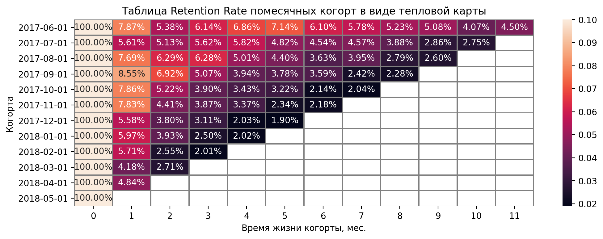


#### Выводы  по 2.1.4.   <a name='step_2.1.4v'></a>
* Расчитанный Retention Rate наглядно показывает, что возвращаемость пользователей в сервис имеет тенденцию к снижению в течении времени жизни когорты (за год снижается до 1% для первой и второй когорты).  
* По новым когортам наблюдается снижение коэффициента за 1-ый месяц жизни (по сравнению с первой когортой) и уменьшение его до 0 - пользователи перестают пользоваться сервисом.  
Для выяснения причин оттока пользователей требуется дополнительное исследование.

### 2.2.  Метрики электронной коммерции (на основании данных заказов)<a name='step_2.2'></a>

#### 2.2.1.  Исследование среднего времени с момента первого посещения сайта до покупки<a name='step_2.2.1'></a>


```python
# создание справочника дат первых заказов пользоватлей (uid)
uid_first_order_ts = df_o.groupby('uid').agg({'buy_ts': 'min'})
uid_first_order_ts = uid_first_order_ts.rename(columns= {'buy_ts': 'first_buy_ts'}).reset_index()
uid_first_order_ts.head()
```


<div>
<style scoped>
    .dataframe tbody tr th:only-of-type {
        vertical-align: middle;
    }

    .dataframe tbody tr th {
        vertical-align: top;
    }

    .dataframe thead th {
        text-align: right;
    }
</style>
<table border="1" class="dataframe">
  <thead>
    <tr style="text-align: right;">
      <th></th>
      <th>uid</th>
      <th>first_buy_ts</th>
    </tr>
  </thead>
  <tbody>
    <tr>
      <th>0</th>
      <td>313578113262317</td>
      <td>2018-01-03 21:51:00</td>
    </tr>
    <tr>
      <th>1</th>
      <td>1575281904278712</td>
      <td>2017-06-03 10:13:00</td>
    </tr>
    <tr>
      <th>2</th>
      <td>2429014661409475</td>
      <td>2017-10-11 18:33:00</td>
    </tr>
    <tr>
      <th>3</th>
      <td>2464366381792757</td>
      <td>2018-01-28 15:54:00</td>
    </tr>
    <tr>
      <th>4</th>
      <td>2551852515556206</td>
      <td>2017-11-24 10:14:00</td>
    </tr>
  </tbody>
</table>
</div>


```python
len(uid_first_order_ts)
```


    36522


```python
# соединение полученного справочника с данными о посещении сайта пользователем
lag_v_o = (df_v[df_v['start_ts'] == df_v['first_ses_ts']]
           [['device', 'source_id', 'first_ses_ts', 'uid']]
           .merge(uid_first_order_ts, how='right', on='uid'))
lag_v_o.head(5)
```


<div>
<style scoped>
    .dataframe tbody tr th:only-of-type {
        vertical-align: middle;
    }

    .dataframe tbody tr th {
        vertical-align: top;
    }

    .dataframe thead th {
        text-align: right;
    }
</style>
<table border="1" class="dataframe">
  <thead>
    <tr style="text-align: right;">
      <th></th>
      <th>device</th>
      <th>source_id</th>
      <th>first_ses_ts</th>
      <th>uid</th>
      <th>first_buy_ts</th>
    </tr>
  </thead>
  <tbody>
    <tr>
      <th>0</th>
      <td>desktop</td>
      <td>2</td>
      <td>2017-09-18 22:49:00</td>
      <td>313578113262317</td>
      <td>2018-01-03 21:51:00</td>
    </tr>
    <tr>
      <th>1</th>
      <td>touch</td>
      <td>10</td>
      <td>2017-06-03 10:13:00</td>
      <td>1575281904278712</td>
      <td>2017-06-03 10:13:00</td>
    </tr>
    <tr>
      <th>2</th>
      <td>desktop</td>
      <td>3</td>
      <td>2017-10-11 17:14:00</td>
      <td>2429014661409475</td>
      <td>2017-10-11 18:33:00</td>
    </tr>
    <tr>
      <th>3</th>
      <td>desktop</td>
      <td>5</td>
      <td>2018-01-27 20:10:00</td>
      <td>2464366381792757</td>
      <td>2018-01-28 15:54:00</td>
    </tr>
    <tr>
      <th>4</th>
      <td>desktop</td>
      <td>5</td>
      <td>2017-11-24 10:14:00</td>
      <td>2551852515556206</td>
      <td>2017-11-24 10:14:00</td>
    </tr>
  </tbody>
</table>
</div>


```python
lag_v_o['first_ses_ts'].isna().sum()
```


    0


Все строки заказов были сопоставлены с временем начала сессии в таблице сессий.


```python
# добавление в итоговую таблицу столбца с длительностью между первым посящением и покупкой (в часах)
lag_v_o['lag_view_order_h'] = (lag_v_o['first_buy_ts'] - lag_v_o['first_ses_ts']) / np.timedelta64(1, 'h')
lag_v_o.sample(10)
```


<div>
<style scoped>
    .dataframe tbody tr th:only-of-type {
        vertical-align: middle;
    }

    .dataframe tbody tr th {
        vertical-align: top;
    }

    .dataframe thead th {
        text-align: right;
    }
</style>
<table border="1" class="dataframe">
  <thead>
    <tr style="text-align: right;">
      <th></th>
      <th>device</th>
      <th>source_id</th>
      <th>first_ses_ts</th>
      <th>uid</th>
      <th>first_buy_ts</th>
      <th>lag_view_order_h</th>
    </tr>
  </thead>
  <tbody>
    <tr>
      <th>14848</th>
      <td>desktop</td>
      <td>3</td>
      <td>2017-10-17 13:11:00</td>
      <td>7459422840375616878</td>
      <td>2017-10-18 22:10:00</td>
      <td>32.983333</td>
    </tr>
    <tr>
      <th>32305</th>
      <td>desktop</td>
      <td>3</td>
      <td>2017-09-19 21:29:00</td>
      <td>16307240880503180240</td>
      <td>2017-09-19 21:34:00</td>
      <td>0.083333</td>
    </tr>
    <tr>
      <th>20292</th>
      <td>desktop</td>
      <td>3</td>
      <td>2017-12-15 12:36:00</td>
      <td>10255413709144240332</td>
      <td>2017-12-15 12:42:00</td>
      <td>0.100000</td>
    </tr>
    <tr>
      <th>3797</th>
      <td>desktop</td>
      <td>3</td>
      <td>2018-05-17 11:31:00</td>
      <td>1916279765328983577</td>
      <td>2018-05-17 11:35:00</td>
      <td>0.066667</td>
    </tr>
    <tr>
      <th>8703</th>
      <td>desktop</td>
      <td>10</td>
      <td>2017-09-22 13:33:00</td>
      <td>4388675629050219785</td>
      <td>2017-09-22 14:17:00</td>
      <td>0.733333</td>
    </tr>
    <tr>
      <th>9682</th>
      <td>desktop</td>
      <td>10</td>
      <td>2018-02-03 22:23:00</td>
      <td>4898212856941559191</td>
      <td>2018-02-03 22:24:00</td>
      <td>0.016667</td>
    </tr>
    <tr>
      <th>8515</th>
      <td>desktop</td>
      <td>3</td>
      <td>2017-11-24 14:25:00</td>
      <td>4289989609388196465</td>
      <td>2017-11-24 15:10:00</td>
      <td>0.750000</td>
    </tr>
    <tr>
      <th>32214</th>
      <td>desktop</td>
      <td>1</td>
      <td>2018-04-02 23:24:00</td>
      <td>16260983371840577820</td>
      <td>2018-04-02 23:26:00</td>
      <td>0.033333</td>
    </tr>
    <tr>
      <th>17137</th>
      <td>desktop</td>
      <td>1</td>
      <td>2017-06-20 12:36:00</td>
      <td>8625171311425605018</td>
      <td>2017-06-20 12:36:00</td>
      <td>0.000000</td>
    </tr>
    <tr>
      <th>30683</th>
      <td>desktop</td>
      <td>3</td>
      <td>2018-01-20 21:37:00</td>
      <td>15464993834453819542</td>
      <td>2018-01-20 21:49:00</td>
      <td>0.200000</td>
    </tr>
  </tbody>
</table>
</div>


```python
lag_v_o['lag_view_order_h'].describe() 
```


    count    36522.000000
    mean       405.680703
    std       1129.759718
    min          0.000000
    25%          0.066667
    50%          0.266667
    75%         48.291667
    max       8719.066667
    Name: lag_view_order_h, dtype: float64


```python
# данные содержат длинный хвост, который на три порядка смещает среднее значения вправо
# рассчитаем верхний ус  
border_value_lag = round(1.5*(lag_v_o['lag_view_order_h'].quantile(q=0.75) - lag_v_o['lag_view_order_h'].quantile(q=0.25)), 2)
border_value_lag
```


    72.34


```python
# построим ящик с усами с ограничением по верхнему усу
lag_v_o[['lag_view_order_h']].boxplot()
plt.title('Boxplot (ящик с усами) длительности между первым посещением и заказом')
plt.ylabel('Часов')
plt.ylim(0, border_value_lag)
plt.show()
```


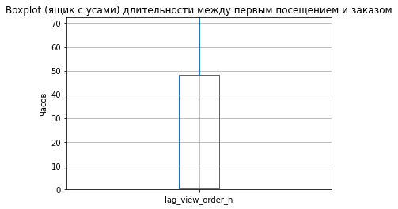


```python
# учитывая такое расспределение данных для построения гистограммы ограничим длительность между посещением и заказом до 2ч.
plt.figure(figsize=(12,4), dpi=200)
sns.distplot(lag_v_o[lag_v_o['lag_view_order_h'].notna() & (lag_v_o['lag_view_order_h'] < 2)]['lag_view_order_h'],
             kde=False)
plt.title('Гистограмма (не полного диапазона значений) времени между первым посещением сайта и покупкой')
plt.ylabel('Частотность значения, шт')
plt.xlabel('Длительность, часов')
plt.show()
```


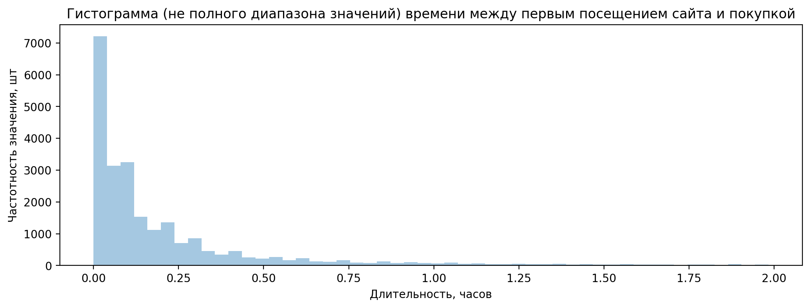


#### Выводы по  2.2.1.  <a name='step_2.2.1v'></a> 
* Распределение значений имеет очень существенный хвост вправо, в результате чего медиана (0.27 ч.) отличается от среднего 406 ч. на три порядка. 
* При таких значениях в качестве среднего значения лучше использовать медиану. 

Таким образом, между первым посещение сайта и заказом в среднем проходит около 30 минут.

#### 2.2.2.  Расчет среднего количества покупок на одного клиента за период<a name='step_2.2.2'></a>


```python
# добавим в данные о заказах столбец формата месяц (datetime)
df_o['buy_m'] = df_o['buy_ts'].astype('datetime64[M]')
```


```python
# добавим в справочник uid_first_order_ts столбец формата месяц (datetime)
uid_first_order_ts['first_buy_m'] = uid_first_order_ts['first_buy_ts'].astype('datetime64[M]')
uid_first_order_ts.head(2)
```


<div>
<style scoped>
    .dataframe tbody tr th:only-of-type {
        vertical-align: middle;
    }

    .dataframe tbody tr th {
        vertical-align: top;
    }

    .dataframe thead th {
        text-align: right;
    }
</style>
<table border="1" class="dataframe">
  <thead>
    <tr style="text-align: right;">
      <th></th>
      <th>uid</th>
      <th>first_buy_ts</th>
      <th>first_buy_m</th>
    </tr>
  </thead>
  <tbody>
    <tr>
      <th>0</th>
      <td>313578113262317</td>
      <td>2018-01-03 21:51:00</td>
      <td>2018-01-01</td>
    </tr>
    <tr>
      <th>1</th>
      <td>1575281904278712</td>
      <td>2017-06-03 10:13:00</td>
      <td>2017-06-01</td>
    </tr>
  </tbody>
</table>
</div>


```python
# добавим данный справочник к данным о заказах df_o
df_o = df_o.merge(uid_first_order_ts, on='uid')
df_o.head()
```


<div>
<style scoped>
    .dataframe tbody tr th:only-of-type {
        vertical-align: middle;
    }

    .dataframe tbody tr th {
        vertical-align: top;
    }

    .dataframe thead th {
        text-align: right;
    }
</style>
<table border="1" class="dataframe">
  <thead>
    <tr style="text-align: right;">
      <th></th>
      <th>buy_ts</th>
      <th>revenue</th>
      <th>uid</th>
      <th>buy_m</th>
      <th>first_buy_ts</th>
      <th>first_buy_m</th>
    </tr>
  </thead>
  <tbody>
    <tr>
      <th>0</th>
      <td>2017-06-01 00:10:00</td>
      <td>17.00</td>
      <td>10329302124590727494</td>
      <td>2017-06-01</td>
      <td>2017-06-01 00:10:00</td>
      <td>2017-06-01</td>
    </tr>
    <tr>
      <th>1</th>
      <td>2017-06-01 00:25:00</td>
      <td>0.55</td>
      <td>11627257723692907447</td>
      <td>2017-06-01</td>
      <td>2017-06-01 00:25:00</td>
      <td>2017-06-01</td>
    </tr>
    <tr>
      <th>2</th>
      <td>2017-06-01 00:27:00</td>
      <td>0.37</td>
      <td>17903680561304213844</td>
      <td>2017-06-01</td>
      <td>2017-06-01 00:27:00</td>
      <td>2017-06-01</td>
    </tr>
    <tr>
      <th>3</th>
      <td>2017-06-01 00:29:00</td>
      <td>0.55</td>
      <td>16109239769442553005</td>
      <td>2017-06-01</td>
      <td>2017-06-01 00:29:00</td>
      <td>2017-06-01</td>
    </tr>
    <tr>
      <th>4</th>
      <td>2017-06-01 07:58:00</td>
      <td>0.37</td>
      <td>14200605875248379450</td>
      <td>2017-06-01</td>
      <td>2017-06-01 07:58:00</td>
      <td>2017-06-01</td>
    </tr>
  </tbody>
</table>
</div>


```python
# добавим в df_o столбец с lifetime когорты (период когор месяц)
```


```python
df_o['lifetime'] = ((df_o['buy_m'] - df_o['first_buy_m']) / np.timedelta64(1, 'M')).round().astype('int')
df_o.sample(5)
```


<div>
<style scoped>
    .dataframe tbody tr th:only-of-type {
        vertical-align: middle;
    }

    .dataframe tbody tr th {
        vertical-align: top;
    }

    .dataframe thead th {
        text-align: right;
    }
</style>
<table border="1" class="dataframe">
  <thead>
    <tr style="text-align: right;">
      <th></th>
      <th>buy_ts</th>
      <th>revenue</th>
      <th>uid</th>
      <th>buy_m</th>
      <th>first_buy_ts</th>
      <th>first_buy_m</th>
      <th>lifetime</th>
    </tr>
  </thead>
  <tbody>
    <tr>
      <th>31708</th>
      <td>2018-01-03 21:51:00</td>
      <td>0.55</td>
      <td>313578113262317</td>
      <td>2018-01-01</td>
      <td>2018-01-03 21:51:00</td>
      <td>2018-01-01</td>
      <td>0</td>
    </tr>
    <tr>
      <th>4897</th>
      <td>2017-07-05 10:31:00</td>
      <td>1.71</td>
      <td>364397414494395726</td>
      <td>2017-07-01</td>
      <td>2017-07-05 10:31:00</td>
      <td>2017-07-01</td>
      <td>0</td>
    </tr>
    <tr>
      <th>27272</th>
      <td>2017-12-10 19:44:00</td>
      <td>1.22</td>
      <td>6524929967185265961</td>
      <td>2017-12-01</td>
      <td>2017-12-10 19:44:00</td>
      <td>2017-12-01</td>
      <td>0</td>
    </tr>
    <tr>
      <th>11269</th>
      <td>2017-09-16 22:39:00</td>
      <td>1.83</td>
      <td>14456906701215476284</td>
      <td>2017-09-01</td>
      <td>2017-09-16 22:39:00</td>
      <td>2017-09-01</td>
      <td>0</td>
    </tr>
    <tr>
      <th>23776</th>
      <td>2017-11-24 22:14:00</td>
      <td>0.09</td>
      <td>16451684419482268692</td>
      <td>2017-11-01</td>
      <td>2017-11-24 22:14:00</td>
      <td>2017-11-01</td>
      <td>0</td>
    </tr>
  </tbody>
</table>
</div>


```python
# сгруппируем данные по когортам и посчитаем сумму заказов, количество заказов, кол. уникальных пользователей
cohort_o_gr_m = df_o.groupby(['first_buy_m', 'lifetime']).agg({'revenue': 'sum', 'uid': ['count', 'nunique']}).reset_index()
cohort_o_gr_m.columns = ['first_buy_m', 'lifetime', 'sum_buy', 'count_buy', 'count_u_users']
cohort_o_gr_m
```


<div>
<style scoped>
    .dataframe tbody tr th:only-of-type {
        vertical-align: middle;
    }

    .dataframe tbody tr th {
        vertical-align: top;
    }

    .dataframe thead th {
        text-align: right;
    }
</style>
<table border="1" class="dataframe">
  <thead>
    <tr style="text-align: right;">
      <th></th>
      <th>first_buy_m</th>
      <th>lifetime</th>
      <th>sum_buy</th>
      <th>count_buy</th>
      <th>count_u_users</th>
    </tr>
  </thead>
  <tbody>
    <tr>
      <th>0</th>
      <td>2017-06-01</td>
      <td>0</td>
      <td>9557.49</td>
      <td>2354</td>
      <td>2023</td>
    </tr>
    <tr>
      <th>1</th>
      <td>2017-06-01</td>
      <td>1</td>
      <td>981.82</td>
      <td>177</td>
      <td>61</td>
    </tr>
    <tr>
      <th>2</th>
      <td>2017-06-01</td>
      <td>2</td>
      <td>885.34</td>
      <td>174</td>
      <td>50</td>
    </tr>
    <tr>
      <th>3</th>
      <td>2017-06-01</td>
      <td>3</td>
      <td>1931.30</td>
      <td>226</td>
      <td>54</td>
    </tr>
    <tr>
      <th>4</th>
      <td>2017-06-01</td>
      <td>4</td>
      <td>2068.58</td>
      <td>292</td>
      <td>88</td>
    </tr>
    <tr>
      <th>...</th>
      <td>...</td>
      <td>...</td>
      <td>...</td>
      <td>...</td>
      <td>...</td>
    </tr>
    <tr>
      <th>73</th>
      <td>2018-03-01</td>
      <td>1</td>
      <td>1063.05</td>
      <td>178</td>
      <td>90</td>
    </tr>
    <tr>
      <th>74</th>
      <td>2018-03-01</td>
      <td>2</td>
      <td>1114.87</td>
      <td>176</td>
      <td>58</td>
    </tr>
    <tr>
      <th>75</th>
      <td>2018-04-01</td>
      <td>0</td>
      <td>10600.69</td>
      <td>2495</td>
      <td>2276</td>
    </tr>
    <tr>
      <th>76</th>
      <td>2018-04-01</td>
      <td>1</td>
      <td>1209.92</td>
      <td>195</td>
      <td>69</td>
    </tr>
    <tr>
      <th>77</th>
      <td>2018-05-01</td>
      <td>0</td>
      <td>13925.76</td>
      <td>3249</td>
      <td>2988</td>
    </tr>
  </tbody>
</table>
<p>78 rows × 5 columns</p>
</div>


```python
# создадим справочник с количеством уникальных пользователей в каждой когорте
cohort_o_count_users = cohort_o_gr_m[cohort_o_gr_m['lifetime'] == 0][['first_buy_m', 'count_u_users']]
cohort_o_count_users = cohort_o_count_users.rename(columns={'count_u_users': 'first_count_users'})
cohort_o_count_users
```


<div>
<style scoped>
    .dataframe tbody tr th:only-of-type {
        vertical-align: middle;
    }

    .dataframe tbody tr th {
        vertical-align: top;
    }

    .dataframe thead th {
        text-align: right;
    }
</style>
<table border="1" class="dataframe">
  <thead>
    <tr style="text-align: right;">
      <th></th>
      <th>first_buy_m</th>
      <th>first_count_users</th>
    </tr>
  </thead>
  <tbody>
    <tr>
      <th>0</th>
      <td>2017-06-01</td>
      <td>2023</td>
    </tr>
    <tr>
      <th>12</th>
      <td>2017-07-01</td>
      <td>1923</td>
    </tr>
    <tr>
      <th>23</th>
      <td>2017-08-01</td>
      <td>1370</td>
    </tr>
    <tr>
      <th>33</th>
      <td>2017-09-01</td>
      <td>2581</td>
    </tr>
    <tr>
      <th>42</th>
      <td>2017-10-01</td>
      <td>4340</td>
    </tr>
    <tr>
      <th>50</th>
      <td>2017-11-01</td>
      <td>4081</td>
    </tr>
    <tr>
      <th>57</th>
      <td>2017-12-01</td>
      <td>4383</td>
    </tr>
    <tr>
      <th>63</th>
      <td>2018-01-01</td>
      <td>3373</td>
    </tr>
    <tr>
      <th>68</th>
      <td>2018-02-01</td>
      <td>3651</td>
    </tr>
    <tr>
      <th>72</th>
      <td>2018-03-01</td>
      <td>3533</td>
    </tr>
    <tr>
      <th>75</th>
      <td>2018-04-01</td>
      <td>2276</td>
    </tr>
    <tr>
      <th>77</th>
      <td>2018-05-01</td>
      <td>2988</td>
    </tr>
  </tbody>
</table>
</div>


```python
# добавим созданный справочник в cohort_o_gr_m
cohort_o_gr_m = cohort_o_gr_m.merge(cohort_o_count_users, on='first_buy_m')
cohort_o_gr_m.head(5)
```


<div>
<style scoped>
    .dataframe tbody tr th:only-of-type {
        vertical-align: middle;
    }

    .dataframe tbody tr th {
        vertical-align: top;
    }

    .dataframe thead th {
        text-align: right;
    }
</style>
<table border="1" class="dataframe">
  <thead>
    <tr style="text-align: right;">
      <th></th>
      <th>first_buy_m</th>
      <th>lifetime</th>
      <th>sum_buy</th>
      <th>count_buy</th>
      <th>count_u_users</th>
      <th>first_count_users</th>
    </tr>
  </thead>
  <tbody>
    <tr>
      <th>0</th>
      <td>2017-06-01</td>
      <td>0</td>
      <td>9557.49</td>
      <td>2354</td>
      <td>2023</td>
      <td>2023</td>
    </tr>
    <tr>
      <th>1</th>
      <td>2017-06-01</td>
      <td>1</td>
      <td>981.82</td>
      <td>177</td>
      <td>61</td>
      <td>2023</td>
    </tr>
    <tr>
      <th>2</th>
      <td>2017-06-01</td>
      <td>2</td>
      <td>885.34</td>
      <td>174</td>
      <td>50</td>
      <td>2023</td>
    </tr>
    <tr>
      <th>3</th>
      <td>2017-06-01</td>
      <td>3</td>
      <td>1931.30</td>
      <td>226</td>
      <td>54</td>
      <td>2023</td>
    </tr>
    <tr>
      <th>4</th>
      <td>2017-06-01</td>
      <td>4</td>
      <td>2068.58</td>
      <td>292</td>
      <td>88</td>
      <td>2023</td>
    </tr>
  </tbody>
</table>
</div>


```python
# добавим столбец с количеством заказов на одного пользователя в когорте по lifetime
cohort_o_gr_m['count_buy_per_one_user'] = cohort_o_gr_m['count_buy'] /  cohort_o_gr_m['first_count_users']
# добавим столбец с выручкой на одного пользователя в когорте по lifetime
cohort_o_gr_m['sum_buy_per_one_user'] = cohort_o_gr_m['sum_buy'] /  cohort_o_gr_m['first_count_users']
cohort_o_gr_m
```


<div>
<style scoped>
    .dataframe tbody tr th:only-of-type {
        vertical-align: middle;
    }

    .dataframe tbody tr th {
        vertical-align: top;
    }

    .dataframe thead th {
        text-align: right;
    }
</style>
<table border="1" class="dataframe">
  <thead>
    <tr style="text-align: right;">
      <th></th>
      <th>first_buy_m</th>
      <th>lifetime</th>
      <th>sum_buy</th>
      <th>count_buy</th>
      <th>count_u_users</th>
      <th>first_count_users</th>
      <th>count_buy_per_one_user</th>
      <th>sum_buy_per_one_user</th>
    </tr>
  </thead>
  <tbody>
    <tr>
      <th>0</th>
      <td>2017-06-01</td>
      <td>0</td>
      <td>9557.49</td>
      <td>2354</td>
      <td>2023</td>
      <td>2023</td>
      <td>1.163618</td>
      <td>4.724414</td>
    </tr>
    <tr>
      <th>1</th>
      <td>2017-06-01</td>
      <td>1</td>
      <td>981.82</td>
      <td>177</td>
      <td>61</td>
      <td>2023</td>
      <td>0.087494</td>
      <td>0.485329</td>
    </tr>
    <tr>
      <th>2</th>
      <td>2017-06-01</td>
      <td>2</td>
      <td>885.34</td>
      <td>174</td>
      <td>50</td>
      <td>2023</td>
      <td>0.086011</td>
      <td>0.437637</td>
    </tr>
    <tr>
      <th>3</th>
      <td>2017-06-01</td>
      <td>3</td>
      <td>1931.30</td>
      <td>226</td>
      <td>54</td>
      <td>2023</td>
      <td>0.111715</td>
      <td>0.954671</td>
    </tr>
    <tr>
      <th>4</th>
      <td>2017-06-01</td>
      <td>4</td>
      <td>2068.58</td>
      <td>292</td>
      <td>88</td>
      <td>2023</td>
      <td>0.144340</td>
      <td>1.022531</td>
    </tr>
    <tr>
      <th>...</th>
      <td>...</td>
      <td>...</td>
      <td>...</td>
      <td>...</td>
      <td>...</td>
      <td>...</td>
      <td>...</td>
      <td>...</td>
    </tr>
    <tr>
      <th>73</th>
      <td>2018-03-01</td>
      <td>1</td>
      <td>1063.05</td>
      <td>178</td>
      <td>90</td>
      <td>3533</td>
      <td>0.050382</td>
      <td>0.300892</td>
    </tr>
    <tr>
      <th>74</th>
      <td>2018-03-01</td>
      <td>2</td>
      <td>1114.87</td>
      <td>176</td>
      <td>58</td>
      <td>3533</td>
      <td>0.049816</td>
      <td>0.315559</td>
    </tr>
    <tr>
      <th>75</th>
      <td>2018-04-01</td>
      <td>0</td>
      <td>10600.69</td>
      <td>2495</td>
      <td>2276</td>
      <td>2276</td>
      <td>1.096221</td>
      <td>4.657597</td>
    </tr>
    <tr>
      <th>76</th>
      <td>2018-04-01</td>
      <td>1</td>
      <td>1209.92</td>
      <td>195</td>
      <td>69</td>
      <td>2276</td>
      <td>0.085677</td>
      <td>0.531599</td>
    </tr>
    <tr>
      <th>77</th>
      <td>2018-05-01</td>
      <td>0</td>
      <td>13925.76</td>
      <td>3249</td>
      <td>2988</td>
      <td>2988</td>
      <td>1.087349</td>
      <td>4.660562</td>
    </tr>
  </tbody>
</table>
<p>78 rows × 8 columns</p>
</div>


```python
# построим сводную таблицу по когортам и по lifetime со значением количества заказов на одного пользователя
cohort_cnt_o_m = cohort_o_gr_m.pivot_table(index='first_buy_m', columns='lifetime', values= 'count_buy_per_one_user').round(2)
cohort_cnt_o_m.index = cohort_cnt_o_m.index.strftime('%Y-%m-%d')
plt.figure(figsize=(12,4), dpi=200)
sns.heatmap(cohort_cnt_o_m, vmax=0.15, annot=True, fmt='.2f', linewidths=1, linecolor='gray')
plt.title('Таблица значений количества заказов на одного пользователя по когортам во времени')
plt.ylabel('Когорта ')
plt.xlabel('Время жизни когорты, мес.')
plt.show()
```


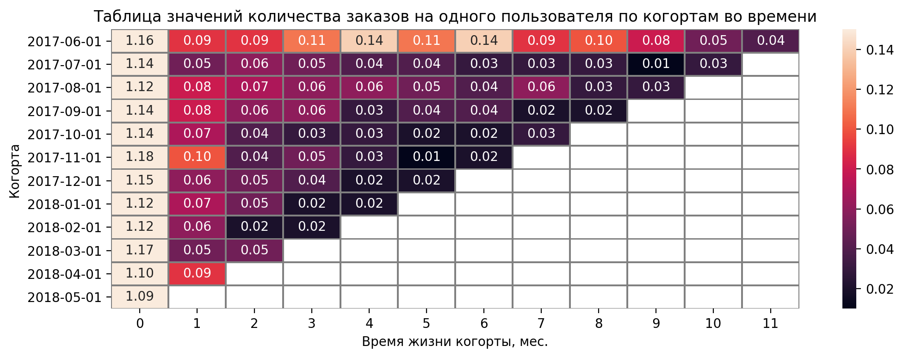


```python
# сделаем срез данных ограничив время жизни когорт 6-ю месяцами и оставив когорты с набором значений за первые 6-ть месяцев
cohort_cnt_o_m_slice = cohort_cnt_o_m.loc[:'2018-01-01', '0':'5']
cohort_cnt_o_m_slice
```


<div>
<style scoped>
    .dataframe tbody tr th:only-of-type {
        vertical-align: middle;
    }

    .dataframe tbody tr th {
        vertical-align: top;
    }

    .dataframe thead th {
        text-align: right;
    }
</style>
<table border="1" class="dataframe">
  <thead>
    <tr style="text-align: right;">
      <th>lifetime</th>
      <th>0</th>
      <th>1</th>
      <th>2</th>
      <th>3</th>
      <th>4</th>
      <th>5</th>
    </tr>
    <tr>
      <th>first_buy_m</th>
      <th></th>
      <th></th>
      <th></th>
      <th></th>
      <th></th>
      <th></th>
    </tr>
  </thead>
  <tbody>
    <tr>
      <th>2017-06-01</th>
      <td>1.16</td>
      <td>0.09</td>
      <td>0.09</td>
      <td>0.11</td>
      <td>0.14</td>
      <td>0.11</td>
    </tr>
    <tr>
      <th>2017-07-01</th>
      <td>1.14</td>
      <td>0.05</td>
      <td>0.06</td>
      <td>0.05</td>
      <td>0.04</td>
      <td>0.04</td>
    </tr>
    <tr>
      <th>2017-08-01</th>
      <td>1.12</td>
      <td>0.08</td>
      <td>0.07</td>
      <td>0.06</td>
      <td>0.06</td>
      <td>0.05</td>
    </tr>
    <tr>
      <th>2017-09-01</th>
      <td>1.14</td>
      <td>0.08</td>
      <td>0.06</td>
      <td>0.06</td>
      <td>0.03</td>
      <td>0.04</td>
    </tr>
    <tr>
      <th>2017-10-01</th>
      <td>1.14</td>
      <td>0.07</td>
      <td>0.04</td>
      <td>0.03</td>
      <td>0.03</td>
      <td>0.02</td>
    </tr>
    <tr>
      <th>2017-11-01</th>
      <td>1.18</td>
      <td>0.10</td>
      <td>0.04</td>
      <td>0.05</td>
      <td>0.03</td>
      <td>0.01</td>
    </tr>
    <tr>
      <th>2017-12-01</th>
      <td>1.15</td>
      <td>0.06</td>
      <td>0.05</td>
      <td>0.04</td>
      <td>0.02</td>
      <td>0.02</td>
    </tr>
    <tr>
      <th>2018-01-01</th>
      <td>1.12</td>
      <td>0.07</td>
      <td>0.05</td>
      <td>0.02</td>
      <td>0.02</td>
      <td>NaN</td>
    </tr>
  </tbody>
</table>
</div>


```python
cohort_cnt_o_m_slice_mean_all = cohort_cnt_o_m_slice.mean(axis=1).round(2)
cohort_cnt_o_m_slice_mean_all
```


    first_buy_m
    2017-06-01    0.28
    2017-07-01    0.23
    2017-08-01    0.24
    2017-09-01    0.24
    2017-10-01    0.22
    2017-11-01    0.24
    2017-12-01    0.22
    2018-01-01    0.26
    dtype: float64


```python
cohort_cnt_o_m_slice_mean_avg = cohort_cnt_o_m_slice_mean_all.mean()
cohort_cnt_o_m_slice_mean_avg
```


    0.24125


#### Выводы по  2.2.2.   <a name='step_2.2.2v'></a>  
* Когортный анализ показывают, что пользователи делают чуть больше одного заказа в первый месяц (~1.15), а затем возвращаемость клиентов в помесячном расчете  5 - 10 % и снижается  до нуля (за несколько месяцева), негативная тенденция усиливается у старших когорт.
* В результате этого, среднее количество покупок на одного пользователя за 6 месяцев составляет 0.235.

При данной низкой возвращаемости пользователей в сервис говорить о среднем количестве заказов за какой-либо период не корректно, потому что фактически пользователь использует сервис в первый месяц и затем уходит из него и те 5-10% процентов возвращаемости могут обеспечивать одни и теже пользователи - постоянные клиенты (подробнее см. дальше разделы исследования).

#### 2.2.3.  Расчет средней выручки с пользователя (изучение динамики метрики во времени)<a name='step_2.2.3'></a>

#### 2.2.3.1.  Расчет в рамках когорт <a name='step_2.2.3.1'></a>


```python
cohort_o_gr_m.head(5)
```


<div>
<style scoped>
    .dataframe tbody tr th:only-of-type {
        vertical-align: middle;
    }

    .dataframe tbody tr th {
        vertical-align: top;
    }

    .dataframe thead th {
        text-align: right;
    }
</style>
<table border="1" class="dataframe">
  <thead>
    <tr style="text-align: right;">
      <th></th>
      <th>first_buy_m</th>
      <th>lifetime</th>
      <th>sum_buy</th>
      <th>count_buy</th>
      <th>count_u_users</th>
      <th>first_count_users</th>
      <th>count_buy_per_one_user</th>
      <th>sum_buy_per_one_user</th>
    </tr>
  </thead>
  <tbody>
    <tr>
      <th>0</th>
      <td>2017-06-01</td>
      <td>0</td>
      <td>9557.49</td>
      <td>2354</td>
      <td>2023</td>
      <td>2023</td>
      <td>1.163618</td>
      <td>4.724414</td>
    </tr>
    <tr>
      <th>1</th>
      <td>2017-06-01</td>
      <td>1</td>
      <td>981.82</td>
      <td>177</td>
      <td>61</td>
      <td>2023</td>
      <td>0.087494</td>
      <td>0.485329</td>
    </tr>
    <tr>
      <th>2</th>
      <td>2017-06-01</td>
      <td>2</td>
      <td>885.34</td>
      <td>174</td>
      <td>50</td>
      <td>2023</td>
      <td>0.086011</td>
      <td>0.437637</td>
    </tr>
    <tr>
      <th>3</th>
      <td>2017-06-01</td>
      <td>3</td>
      <td>1931.30</td>
      <td>226</td>
      <td>54</td>
      <td>2023</td>
      <td>0.111715</td>
      <td>0.954671</td>
    </tr>
    <tr>
      <th>4</th>
      <td>2017-06-01</td>
      <td>4</td>
      <td>2068.58</td>
      <td>292</td>
      <td>88</td>
      <td>2023</td>
      <td>0.144340</td>
      <td>1.022531</td>
    </tr>
  </tbody>
</table>
</div>


```python
plt.figure(figsize=(12,4), dpi=200)
sns.distplot(cohort_o_gr_m['sum_buy_per_one_user'],kde=False)
plt.title('Гистограмма средней выручки на пользователя')
plt.ylabel('Частотность значения, шт')
plt.xlabel('Выручка, у.е.')
plt.show()
```


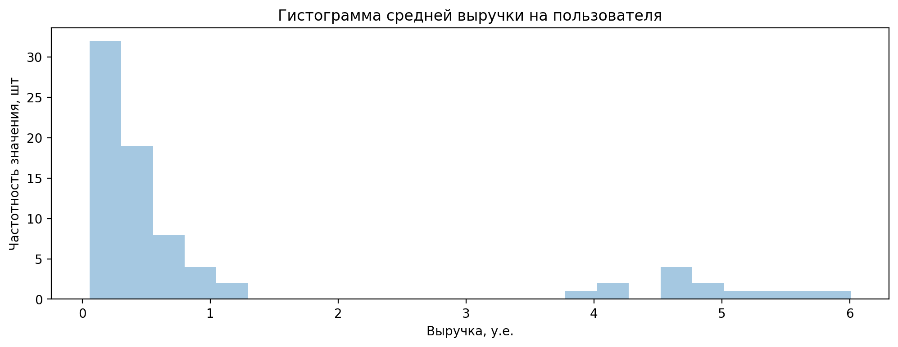


Распредееление значений средней выручки показывает, что фактически у нас присутствует два распределения средней выручки:  
* распределение в первый месяц заказа;
* распределение в остальные месяцы (без учета первого месяца)  

Поэтому считать общую среднюю при данном виде распределения - не корректно и такое среднее не отразит фактическую ситуацию в сервисе.
В данной ситуации необходимо рассчитать отдельно среднее значение (как mean) для первого месяца когорты (lifetime=0) и медиану для всех других значений lifetime (медиану, поскольку распределение скошено влево)


```python
# среднее значение (mean) в первый месяц когорты за весь период
round(cohort_o_gr_m[cohort_o_gr_m['lifetime'] == 0]['sum_buy_per_one_user'].mean(), 2)
```


    4.92


```python
# среднее значение (median) в  месяцы когорты (кроме первого) за весь период
round(cohort_o_gr_m[cohort_o_gr_m['lifetime'] != 0]['sum_buy_per_one_user'].median(), 2)
```


    0.31


```python
# создадим сводную таблицу для анализа средней выручки с пользователя во времени
cohort_sum_o_m = cohort_o_gr_m.pivot_table(index='first_buy_m', columns='lifetime', values= 'sum_buy_per_one_user').round(2)
cohort_sum_o_m.index = cohort_sum_o_m.index.strftime('%Y-%m-%d')
plt.figure(figsize=(12,4), dpi=200)
sns.heatmap(cohort_sum_o_m, vmax=1.2, annot=True, fmt='.2f', linewidths=1, linecolor='gray')
plt.title('Выручка с одного пользователя по когортам во времени')
plt.ylabel('Когорта ')
plt.xlabel('Время жизни когорты, мес.')
plt.show()
```


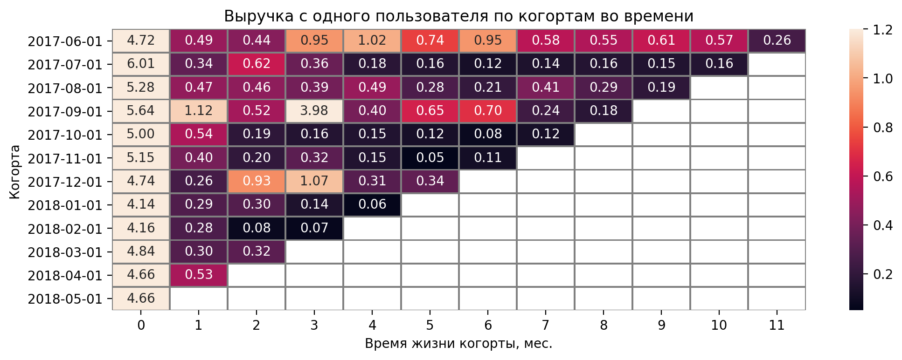


#### 2.2.3.2.  Без деления на когорты<a name='step_2.2.3.2'></a>


```python
df_o.head()
```


<div>
<style scoped>
    .dataframe tbody tr th:only-of-type {
        vertical-align: middle;
    }

    .dataframe tbody tr th {
        vertical-align: top;
    }

    .dataframe thead th {
        text-align: right;
    }
</style>
<table border="1" class="dataframe">
  <thead>
    <tr style="text-align: right;">
      <th></th>
      <th>buy_ts</th>
      <th>revenue</th>
      <th>uid</th>
      <th>buy_m</th>
      <th>first_buy_ts</th>
      <th>first_buy_m</th>
      <th>lifetime</th>
    </tr>
  </thead>
  <tbody>
    <tr>
      <th>0</th>
      <td>2017-06-01 00:10:00</td>
      <td>17.00</td>
      <td>10329302124590727494</td>
      <td>2017-06-01</td>
      <td>2017-06-01 00:10:00</td>
      <td>2017-06-01</td>
      <td>0</td>
    </tr>
    <tr>
      <th>1</th>
      <td>2017-06-01 00:25:00</td>
      <td>0.55</td>
      <td>11627257723692907447</td>
      <td>2017-06-01</td>
      <td>2017-06-01 00:25:00</td>
      <td>2017-06-01</td>
      <td>0</td>
    </tr>
    <tr>
      <th>2</th>
      <td>2017-06-01 00:27:00</td>
      <td>0.37</td>
      <td>17903680561304213844</td>
      <td>2017-06-01</td>
      <td>2017-06-01 00:27:00</td>
      <td>2017-06-01</td>
      <td>0</td>
    </tr>
    <tr>
      <th>3</th>
      <td>2017-06-01 00:29:00</td>
      <td>0.55</td>
      <td>16109239769442553005</td>
      <td>2017-06-01</td>
      <td>2017-06-01 00:29:00</td>
      <td>2017-06-01</td>
      <td>0</td>
    </tr>
    <tr>
      <th>4</th>
      <td>2017-06-01 07:58:00</td>
      <td>0.37</td>
      <td>14200605875248379450</td>
      <td>2017-06-01</td>
      <td>2017-06-01 07:58:00</td>
      <td>2017-06-01</td>
      <td>0</td>
    </tr>
  </tbody>
</table>
</div>


```python
#  рассчитаем суммарные значения  (общую выручку и количество уникальных клиентов) по каждому месяцу отдельно
mean_buy_month = df_o.groupby('buy_m').agg({'revenue': 'sum', 'uid':'nunique'}).reset_index()
mean_buy_month.columns = ['buy_m','sum_buy', 'count_u_users']
# средняя выручка с пользователя в месяц
mean_buy_month['sum_per_one_user'] = (mean_buy_month['sum_buy'] / mean_buy_month['count_u_users']).round(2)
mean_buy_month
```


<div>
<style scoped>
    .dataframe tbody tr th:only-of-type {
        vertical-align: middle;
    }

    .dataframe tbody tr th {
        vertical-align: top;
    }

    .dataframe thead th {
        text-align: right;
    }
</style>
<table border="1" class="dataframe">
  <thead>
    <tr style="text-align: right;">
      <th></th>
      <th>buy_m</th>
      <th>sum_buy</th>
      <th>count_u_users</th>
      <th>sum_per_one_user</th>
    </tr>
  </thead>
  <tbody>
    <tr>
      <th>0</th>
      <td>2017-06-01</td>
      <td>9557.49</td>
      <td>2023</td>
      <td>4.72</td>
    </tr>
    <tr>
      <th>1</th>
      <td>2017-07-01</td>
      <td>12539.47</td>
      <td>1984</td>
      <td>6.32</td>
    </tr>
    <tr>
      <th>2</th>
      <td>2017-08-01</td>
      <td>8758.78</td>
      <td>1472</td>
      <td>5.95</td>
    </tr>
    <tr>
      <th>3</th>
      <td>2017-09-01</td>
      <td>18345.51</td>
      <td>2750</td>
      <td>6.67</td>
    </tr>
    <tr>
      <th>4</th>
      <td>2017-10-01</td>
      <td>27987.70</td>
      <td>4675</td>
      <td>5.99</td>
    </tr>
    <tr>
      <th>5</th>
      <td>2017-11-01</td>
      <td>27069.93</td>
      <td>4547</td>
      <td>5.95</td>
    </tr>
    <tr>
      <th>6</th>
      <td>2017-12-01</td>
      <td>36388.60</td>
      <td>4942</td>
      <td>7.36</td>
    </tr>
    <tr>
      <th>7</th>
      <td>2018-01-01</td>
      <td>19417.13</td>
      <td>3898</td>
      <td>4.98</td>
    </tr>
    <tr>
      <th>8</th>
      <td>2018-02-01</td>
      <td>25560.54</td>
      <td>4258</td>
      <td>6.00</td>
    </tr>
    <tr>
      <th>9</th>
      <td>2018-03-01</td>
      <td>28834.59</td>
      <td>4181</td>
      <td>6.90</td>
    </tr>
    <tr>
      <th>10</th>
      <td>2018-04-01</td>
      <td>16858.06</td>
      <td>2744</td>
      <td>6.14</td>
    </tr>
    <tr>
      <th>11</th>
      <td>2018-05-01</td>
      <td>20735.98</td>
      <td>3544</td>
      <td>5.85</td>
    </tr>
  </tbody>
</table>
</div>


```python
#  рассчитаем среднее значение ежемесячной выручки на одного пользователя за все периоды 
round(mean_buy_month['sum_per_one_user'].mean(), 2)
print(f"Средняя выручка с пользователя = {round(mean_buy_month['sum_per_one_user'].mean(), 2)} у.е.")
```

    Средняя выручка с пользователя = 6.07 у.е.


```python
plt.figure(figsize=(12,4), dpi=200)
sns.lineplot(x='buy_m', y='sum_per_one_user', data=mean_buy_month, label='Cред. выручка с польз. в месяц ')
plt.title('График изменения средней выручки с одного пользователя по месяцам')
plt.xlabel('')
plt.ylabel('Средняя выручка с пользователя, у.е.')
plt.xticks(ticks=mean_buy_month['buy_m'], rotation=45)
plt.axhline(round(mean_buy_month['sum_per_one_user'].mean(), 2),
            ls='--', c='r', label='Cред. выручка с польз. за весь период')
plt.legend()
plt.show()
```


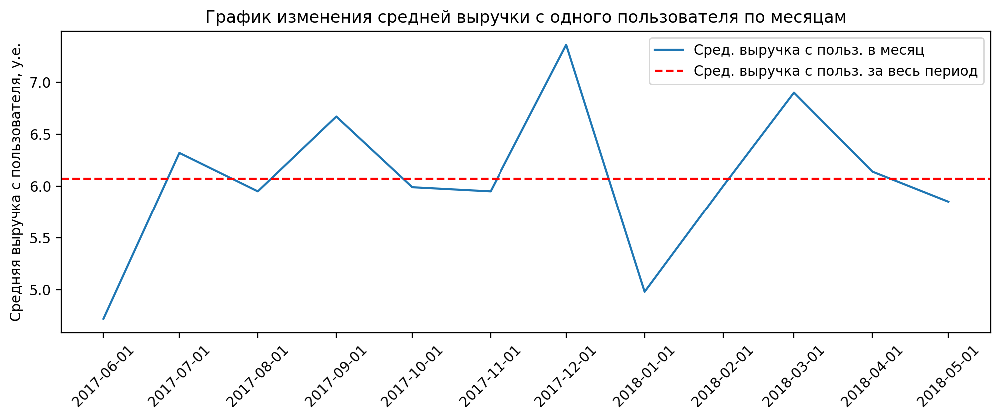


#### Выводы по  2.2.3.  <a name='step_2.2.3v'></a>
#### С учетом когортного анализа
* Распределение данных имеет две вершины, поэтому отдельно рассчитывается среднее значение для первого месяца когорты и среднее значение для всех остальных месяцев.
* Для первого месяца когорт среднее значение выручки на одного пользователя 4.94 у.е.
* Для остальных месяцев когорт среднее значение - 0.28 у.е.
* Изменение во времени среднего значения выручки на пользователя в первый месяц имеет волнообразную форму по мере появления новых когорт.
* Изменение во времени среднего значения для остальных периодов жизни когорт имеет тенденцию к снижению по мере жизни когорты, причем достижение значений, стремящихся к 0 по мере появления новых когорт происходит в более короткий период.  
* В сентябрьской когоре для lifetime=3 наблюдается несвойственное большое (на порядок больше других) значение средней выручки (причины таких всплесков описаны в Дополнительнном выводе этого раздела).  

#### Без  когортного анализа   
* Средняя выручка с пользователя за весь период составляет 6.07 у.е.  
* В течении времени эта метрика имеет периоды роста и падений.В целом колебания происходят вокруг среднего значения, однако начало периода и его завершение характеризуются низкими значениями метрики (ниже среднего за период).  

#### Примечание: разница в значениях рассчитываемых с учетом когорт и без учета когорт объясняется разной методикой расчета показателей и свидетельстует о том, что средний чек повторной покупки больше, чем чек первичной покупки.  
#### Для подтверждения этого предположения рассчитаем средний чек покупки по когортам


```python
cohort_o_gr_m['avg_check'] = cohort_o_gr_m['sum_buy'] / cohort_o_gr_m['count_buy']
avg_check_cohort = cohort_o_gr_m.pivot_table(index='first_buy_m', columns='lifetime', values='avg_check').round(2)
avg_check_cohort.index = avg_check_cohort.index.strftime('%Y-%m-%d')
plt.figure(figsize=(12,4), dpi=200)
sns.heatmap(avg_check_cohort, vmax=20, annot=True, fmt='.2f', linewidths=1, linecolor='gray')
plt.title('Средний чек по когортам во времени')
plt.ylabel('Когорта ')
plt.xlabel('Время жизни когорты, мес.')
plt.show()
```


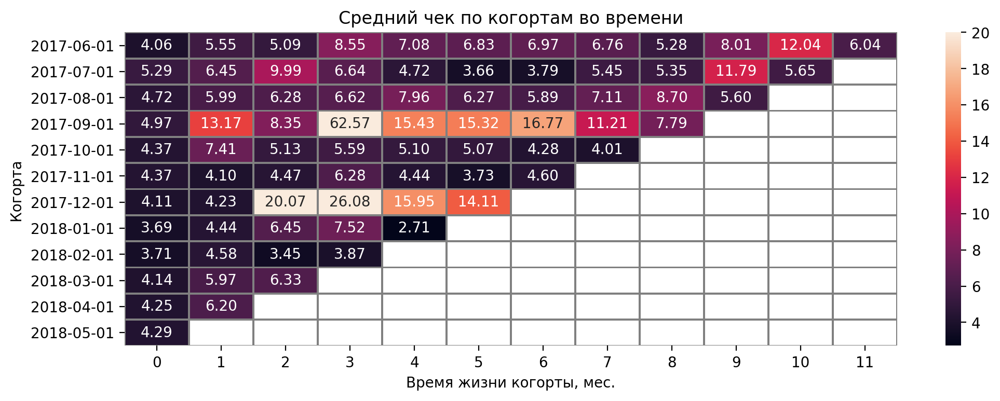


#### Дополнительный вывод  
* Всплески средней выручки, наблюдаемые в тепловой карте когортного анализа средней выручки с пользователя объясняются тем, что в периоды жизни когорт (когда lifetime не равно "0") наблюдаются месяцы когда пользователи сервиса в рамках одной покупки приобретают либо очень большое количество билетов, либо приобретаются билеты на мероприятия, стоимость билетов на которые на порядок выше средней стоимости остальных билетов (для правильной траковки результата имеющихся данных не достаточно). Назовем эти покупки для дальнейшего упоминания как "оптовые".

#### 2.2.4.  Анализ накопительного LTV по когортам во времени<a name='step_2.2.4'></a>


```python
# используем ранее составленную сводную таблицу cohort_sum_o_m для изучения накопительного LTV
# выручка равна валовой прибыли т.к. маржинальность сервиса 100%
# для расчета накопительного lTV по когорта используем метод cumsum()
cohort_ltv_cum_m = cohort_sum_o_m.cumsum(axis=1)
plt.figure(figsize=(12,4), dpi=200)
sns.heatmap(cohort_ltv_cum_m, annot=True, fmt='.2f', linewidths=1, linecolor='gray')
plt.title('Накопительный LTV  по когортам во времени')
plt.ylabel('Когорта ')
plt.xlabel('Время жизни когорты, мес.')
plt.show()
```


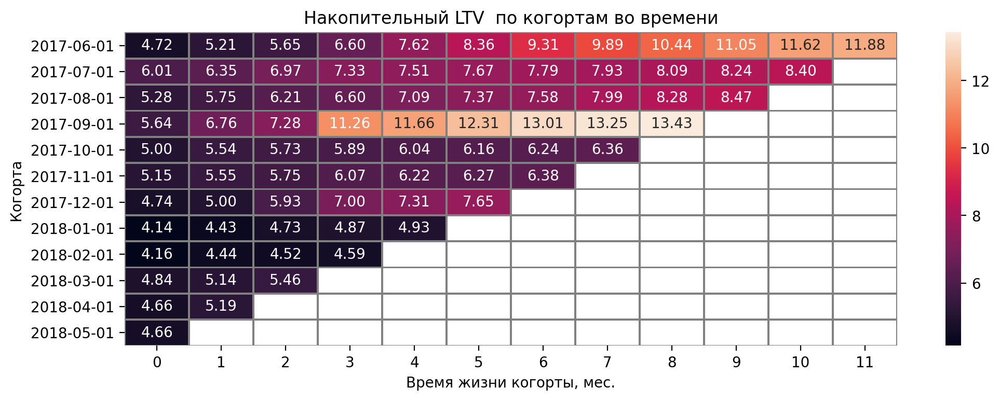


```python
# ограничим накопительный LTV данными за полные 6 месяцев когор
cohort_ltv_cum_m = cohort_sum_o_m.cumsum(axis=1)
plt.figure(figsize=(12,4), dpi=200)
sns.heatmap(cohort_ltv_cum_m.loc[:'2017-12-01', '0':'5'], annot=True, fmt='.2f', linewidths=1, linecolor='gray')
plt.title('Накопительный LTV  по когортам (в периоде 6 месяцев)')
plt.ylabel('Когорта ')
plt.xlabel('Время жизни когорты, мес.')
plt.show()
```


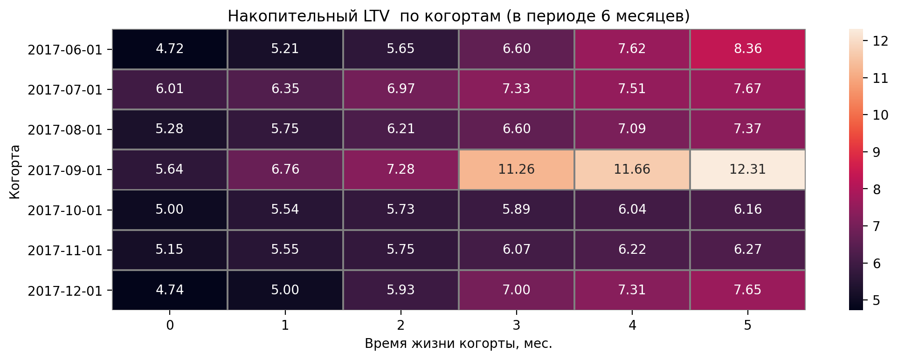


```python

cohort_ltv_cum_m.loc[:'2017-12-01', '5':'5'].plot(grid=True, figsize=(12,6), legend=False)
plt.title('График изменения накопительного LTV (за 6 месяцев) по когортам')
plt.ylabel('Накопительный LTV, у.е.')
plt.show()
```


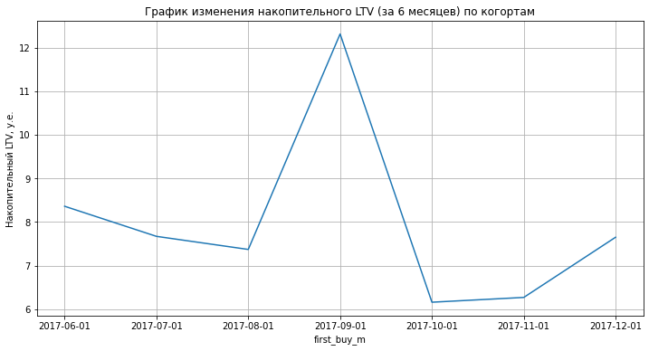


#### Выводы по  2.2.4.  <a name='step_2.2.4v'></a> 
* Накопительный LTV по когортам с появлением новых когор уменьшается (всплеск в сентябрьской когорте объясняется "оптовой" покупкой, что было рассмотрено выше в разделе "Выводы по 2.2.3."). Декабрь "особенный" месяц, поэтому не показателен.


### 2.3.  Маркетинговые метрики<a name='step_2.3'></a>

#### 2.3.1. Общая сумма расходов на маркетинг,  распределение расходов по источникам,  изменение распределения во времени<a name='step_2.3.1'></a>


```python
print(f"Общая сумма расходов на маркетинг = {df_c['costs'].sum(): .2f} у.е.")
```

    Общая сумма расходов на маркетинг =  329131.62 у.е.


```python
# добавление столбца с датой в разрезе месяца в формате str и datetime
df_c['y_m_dt'] = df_c['dt'].dt.strftime('%Y-%m-01')
df_c['first_buy_m'] = df_c['dt'].astype('datetime64[M]')
df_c.sample(3)
```


<div>
<style scoped>
    .dataframe tbody tr th:only-of-type {
        vertical-align: middle;
    }

    .dataframe tbody tr th {
        vertical-align: top;
    }

    .dataframe thead th {
        text-align: right;
    }
</style>
<table border="1" class="dataframe">
  <thead>
    <tr style="text-align: right;">
      <th></th>
      <th>source_id</th>
      <th>dt</th>
      <th>costs</th>
      <th>y_m_dt</th>
      <th>first_buy_m</th>
    </tr>
  </thead>
  <tbody>
    <tr>
      <th>225</th>
      <td>1</td>
      <td>2018-01-12</td>
      <td>54.48</td>
      <td>2018-01-01</td>
      <td>2018-01-01</td>
    </tr>
    <tr>
      <th>1571</th>
      <td>5</td>
      <td>2017-09-28</td>
      <td>186.56</td>
      <td>2017-09-01</td>
      <td>2017-09-01</td>
    </tr>
    <tr>
      <th>1739</th>
      <td>5</td>
      <td>2018-03-15</td>
      <td>127.64</td>
      <td>2018-03-01</td>
      <td>2018-03-01</td>
    </tr>
  </tbody>
</table>
</div>


```python
# построение сводной таблицы с подитогами
mark_gr_s_t = df_c.pivot_table(index='source_id', columns='y_m_dt', values='costs', aggfunc='sum',  margins=True)
mark_gr_s_t
```


<div>
<style scoped>
    .dataframe tbody tr th:only-of-type {
        vertical-align: middle;
    }

    .dataframe tbody tr th {
        vertical-align: top;
    }

    .dataframe thead th {
        text-align: right;
    }
</style>
<table border="1" class="dataframe">
  <thead>
    <tr style="text-align: right;">
      <th>y_m_dt</th>
      <th>2017-06-01</th>
      <th>2017-07-01</th>
      <th>2017-08-01</th>
      <th>2017-09-01</th>
      <th>2017-10-01</th>
      <th>2017-11-01</th>
      <th>2017-12-01</th>
      <th>2018-01-01</th>
      <th>2018-02-01</th>
      <th>2018-03-01</th>
      <th>2018-04-01</th>
      <th>2018-05-01</th>
      <th>All</th>
    </tr>
    <tr>
      <th>source_id</th>
      <th></th>
      <th></th>
      <th></th>
      <th></th>
      <th></th>
      <th></th>
      <th></th>
      <th></th>
      <th></th>
      <th></th>
      <th></th>
      <th></th>
      <th></th>
    </tr>
  </thead>
  <tbody>
    <tr>
      <th>1</th>
      <td>1125.61</td>
      <td>1072.88</td>
      <td>951.81</td>
      <td>1502.01</td>
      <td>2315.75</td>
      <td>2445.16</td>
      <td>2341.20</td>
      <td>2186.18</td>
      <td>2204.48</td>
      <td>1893.09</td>
      <td>1327.49</td>
      <td>1467.61</td>
      <td>20833.27</td>
    </tr>
    <tr>
      <th>2</th>
      <td>2427.38</td>
      <td>2333.11</td>
      <td>1811.05</td>
      <td>2985.66</td>
      <td>4845.00</td>
      <td>5247.68</td>
      <td>4897.80</td>
      <td>4157.74</td>
      <td>4474.34</td>
      <td>3943.14</td>
      <td>2993.70</td>
      <td>2689.44</td>
      <td>42806.04</td>
    </tr>
    <tr>
      <th>3</th>
      <td>7731.65</td>
      <td>7674.37</td>
      <td>6143.54</td>
      <td>9963.55</td>
      <td>15737.24</td>
      <td>17025.34</td>
      <td>16219.52</td>
      <td>14808.78</td>
      <td>14228.56</td>
      <td>13080.85</td>
      <td>9296.81</td>
      <td>9411.42</td>
      <td>141321.63</td>
    </tr>
    <tr>
      <th>4</th>
      <td>3514.80</td>
      <td>3529.73</td>
      <td>3217.36</td>
      <td>5192.26</td>
      <td>6420.84</td>
      <td>5388.82</td>
      <td>7680.47</td>
      <td>5832.79</td>
      <td>5711.96</td>
      <td>5961.87</td>
      <td>4408.49</td>
      <td>4214.21</td>
      <td>61073.60</td>
    </tr>
    <tr>
      <th>5</th>
      <td>2616.12</td>
      <td>2998.14</td>
      <td>2185.28</td>
      <td>3849.14</td>
      <td>5767.40</td>
      <td>6325.34</td>
      <td>5872.52</td>
      <td>5371.52</td>
      <td>5071.31</td>
      <td>4529.62</td>
      <td>3501.15</td>
      <td>3669.56</td>
      <td>51757.10</td>
    </tr>
    <tr>
      <th>9</th>
      <td>285.22</td>
      <td>302.54</td>
      <td>248.93</td>
      <td>415.62</td>
      <td>609.41</td>
      <td>683.18</td>
      <td>657.98</td>
      <td>547.16</td>
      <td>551.50</td>
      <td>480.29</td>
      <td>373.49</td>
      <td>362.17</td>
      <td>5517.49</td>
    </tr>
    <tr>
      <th>10</th>
      <td>314.22</td>
      <td>329.82</td>
      <td>232.57</td>
      <td>460.67</td>
      <td>627.24</td>
      <td>792.36</td>
      <td>645.86</td>
      <td>614.35</td>
      <td>480.88</td>
      <td>526.41</td>
      <td>388.25</td>
      <td>409.86</td>
      <td>5822.49</td>
    </tr>
    <tr>
      <th>All</th>
      <td>18015.00</td>
      <td>18240.59</td>
      <td>14790.54</td>
      <td>24368.91</td>
      <td>36322.88</td>
      <td>37907.88</td>
      <td>38315.35</td>
      <td>33518.52</td>
      <td>32723.03</td>
      <td>30415.27</td>
      <td>22289.38</td>
      <td>22224.27</td>
      <td>329131.62</td>
    </tr>
  </tbody>
</table>
</div>


```python
mark_gr_s_t.loc[[1, 2, 3, 4, 5, 9, 10], '2017-06-01':'2018-05-01'].T.plot(grid=True, figsize=(16,6))
plt.title('График изменения расходов по источникам рекламы (source_id) во времени')
plt.ylabel('Расходы, у.е.')
plt.xlabel('Месяцы')
plt.show()
```


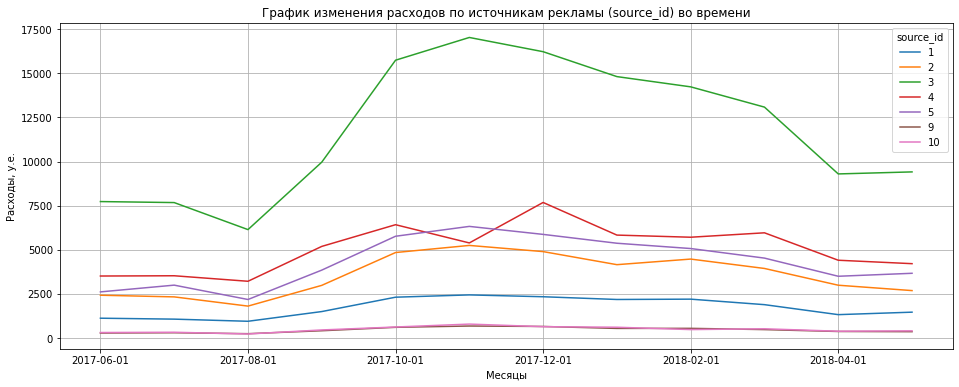


```python
mark_gr_s_t.loc['All', '2017-06-01':'2018-05-01'].T.plot(grid=True, figsize=(16,6))
plt.title('График изменения общих расходов на рекламу во времени')
plt.ylabel('Расходы, у.е.')
plt.xlabel('Месяцы')
plt.show()
```


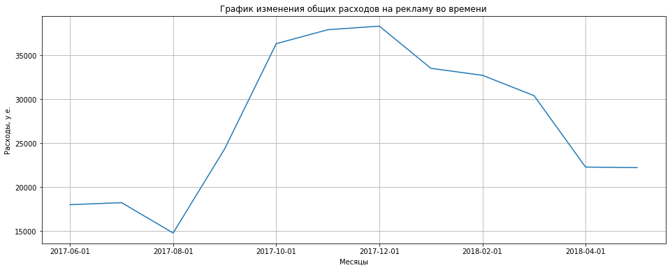


#### Выводы по  2.3.1.  <a name='step_2.3.1v'></a>  
* Общая сумма расходов на маркетинг =  329_131.62 у.е.
* Расходы на рекламу по источникам распределены неравномерно и выделяется источкик 3, расходы на который превышает все остальные источники в разы.  
* Динамика изменения расходов представлена на графиках.
* В связи с тем, что расходы на источник 3 превышают все остальные расходы по источникам, динамика общих расходов на рекламу соответсвует динамике расходов источника 3.

#### 2.3.2.  CAC<a name='step_2.3.2'></a>


```python
# справочник количества уникальных посетителей в месяц
ses_cnt_uuser_grby_sour_month = df_v.groupby(['source_id', 'ses_m_dt']).agg({'uid': 'nunique'}).reset_index()
ses_cnt_uuser_grby_sour_month = (ses_cnt_uuser_grby_sour_month
                                 .rename(columns={'ses_m_dt': 'first_buy_m' , 'uid': 'cnt_un_users_ses'}))
ses_cnt_uuser_grby_sour_month.head(10)
```


<div>
<style scoped>
    .dataframe tbody tr th:only-of-type {
        vertical-align: middle;
    }

    .dataframe tbody tr th {
        vertical-align: top;
    }

    .dataframe thead th {
        text-align: right;
    }
</style>
<table border="1" class="dataframe">
  <thead>
    <tr style="text-align: right;">
      <th></th>
      <th>source_id</th>
      <th>first_buy_m</th>
      <th>cnt_un_users_ses</th>
    </tr>
  </thead>
  <tbody>
    <tr>
      <th>0</th>
      <td>1</td>
      <td>2017-06-01</td>
      <td>972</td>
    </tr>
    <tr>
      <th>1</th>
      <td>1</td>
      <td>2017-07-01</td>
      <td>1047</td>
    </tr>
    <tr>
      <th>2</th>
      <td>1</td>
      <td>2017-08-01</td>
      <td>794</td>
    </tr>
    <tr>
      <th>3</th>
      <td>1</td>
      <td>2017-09-01</td>
      <td>1395</td>
    </tr>
    <tr>
      <th>4</th>
      <td>1</td>
      <td>2017-10-01</td>
      <td>2170</td>
    </tr>
    <tr>
      <th>5</th>
      <td>1</td>
      <td>2017-11-01</td>
      <td>2790</td>
    </tr>
    <tr>
      <th>6</th>
      <td>1</td>
      <td>2017-12-01</td>
      <td>2735</td>
    </tr>
    <tr>
      <th>7</th>
      <td>1</td>
      <td>2018-01-01</td>
      <td>2142</td>
    </tr>
    <tr>
      <th>8</th>
      <td>1</td>
      <td>2018-02-01</td>
      <td>2121</td>
    </tr>
    <tr>
      <th>9</th>
      <td>1</td>
      <td>2018-03-01</td>
      <td>2289</td>
    </tr>
  </tbody>
</table>
</div>


```python
# справочник источников и устройств первой сессии для пользователей
first_ses_source_device_by_users = (df_v.loc[(df_v['start_ts'] == df_v['first_ses_ts']),
                                              ['uid', 'source_id', 'device']])
first_ses_source_device_by_users
```


<div>
<style scoped>
    .dataframe tbody tr th:only-of-type {
        vertical-align: middle;
    }

    .dataframe tbody tr th {
        vertical-align: top;
    }

    .dataframe thead th {
        text-align: right;
    }
</style>
<table border="1" class="dataframe">
  <thead>
    <tr style="text-align: right;">
      <th></th>
      <th>uid</th>
      <th>source_id</th>
      <th>device</th>
    </tr>
  </thead>
  <tbody>
    <tr>
      <th>0</th>
      <td>16879256277535980062</td>
      <td>4</td>
      <td>touch</td>
    </tr>
    <tr>
      <th>1</th>
      <td>104060357244891740</td>
      <td>2</td>
      <td>desktop</td>
    </tr>
    <tr>
      <th>2</th>
      <td>7459035603376831527</td>
      <td>5</td>
      <td>touch</td>
    </tr>
    <tr>
      <th>4</th>
      <td>9969694820036681168</td>
      <td>3</td>
      <td>desktop</td>
    </tr>
    <tr>
      <th>5</th>
      <td>16007536194108375387</td>
      <td>5</td>
      <td>desktop</td>
    </tr>
    <tr>
      <th>...</th>
      <td>...</td>
      <td>...</td>
      <td>...</td>
    </tr>
    <tr>
      <th>359395</th>
      <td>18363291481961487539</td>
      <td>2</td>
      <td>desktop</td>
    </tr>
    <tr>
      <th>359396</th>
      <td>18370831553019119586</td>
      <td>1</td>
      <td>touch</td>
    </tr>
    <tr>
      <th>359397</th>
      <td>18387297585500748294</td>
      <td>4</td>
      <td>desktop</td>
    </tr>
    <tr>
      <th>359398</th>
      <td>18388616944624776485</td>
      <td>5</td>
      <td>desktop</td>
    </tr>
    <tr>
      <th>359399</th>
      <td>18396128934054549559</td>
      <td>2</td>
      <td>touch</td>
    </tr>
  </tbody>
</table>
<p>228170 rows × 3 columns</p>
</div>


```python
# проверим строки на уникальность по uid
uid_prodlem = first_ses_source_device_by_users['uid'].duplicated()
first_ses_source_device_by_users[uid_prodlem]['uid']
```


    47067    1981020429381477763
    Name: uid, dtype: uint64


```python
# "изучим глазами", что не так с этим uid
df_v[df_v['uid'] == 1981020429381477763]
```


<div>
<style scoped>
    .dataframe tbody tr th:only-of-type {
        vertical-align: middle;
    }

    .dataframe tbody tr th {
        vertical-align: top;
    }

    .dataframe thead th {
        text-align: right;
    }
</style>
<table border="1" class="dataframe">
  <thead>
    <tr style="text-align: right;">
      <th></th>
      <th>device</th>
      <th>end_ts</th>
      <th>source_id</th>
      <th>start_ts</th>
      <th>uid</th>
      <th>ses_m</th>
      <th>ses_w</th>
      <th>ses_d</th>
      <th>ses_m_dt</th>
      <th>ses_duration_sec</th>
      <th>first_ses_ts</th>
      <th>first_ses_w</th>
      <th>first_ses_m</th>
      <th>first_ses_d</th>
      <th>lifetime</th>
    </tr>
  </thead>
  <tbody>
    <tr>
      <th>44993</th>
      <td>touch</td>
      <td>2018-03-16 08:57:00</td>
      <td>1</td>
      <td>2018-03-16 08:55:00</td>
      <td>1981020429381477763</td>
      <td>2018-03</td>
      <td>1811</td>
      <td>2018-03-16</td>
      <td>2018-03-01</td>
      <td>120</td>
      <td>2018-03-16 08:55:00</td>
      <td>1811</td>
      <td>2018-03-01</td>
      <td>2018-03-16</td>
      <td>0</td>
    </tr>
    <tr>
      <th>47067</th>
      <td>touch</td>
      <td>2018-03-16 08:55:00</td>
      <td>1</td>
      <td>2018-03-16 08:55:00</td>
      <td>1981020429381477763</td>
      <td>2018-03</td>
      <td>1811</td>
      <td>2018-03-16</td>
      <td>2018-03-01</td>
      <td>0</td>
      <td>2018-03-16 08:55:00</td>
      <td>1811</td>
      <td>2018-03-01</td>
      <td>2018-03-16</td>
      <td>0</td>
    </tr>
  </tbody>
</table>
</div>


У этого пользователя две сессии начинаются одновременно , но одна нулевой длительности, другая 120 секунд device и source_id, совпадают, поэтому одну из этих строк удаляем (для этого используем полученную ранее логическую маску).  
Примечание: Необходимо информировать о данном инциденте ответственных сотрудников для принятия мер.


```python
first_ses_source_device_by_users = first_ses_source_device_by_users[~uid_prodlem]
len(first_ses_source_device_by_users)
```


    228169


```python
# добавим в таблицу заказов информацию об источниках и устройстве первой сессии
# для этого соединим таблицы по uid
df_o = df_o.merge(first_ses_source_device_by_users, on='uid')
df_o.head()
```


<div>
<style scoped>
    .dataframe tbody tr th:only-of-type {
        vertical-align: middle;
    }

    .dataframe tbody tr th {
        vertical-align: top;
    }

    .dataframe thead th {
        text-align: right;
    }
</style>
<table border="1" class="dataframe">
  <thead>
    <tr style="text-align: right;">
      <th></th>
      <th>buy_ts</th>
      <th>revenue</th>
      <th>uid</th>
      <th>buy_m</th>
      <th>first_buy_ts</th>
      <th>first_buy_m</th>
      <th>lifetime</th>
      <th>source_id</th>
      <th>device</th>
    </tr>
  </thead>
  <tbody>
    <tr>
      <th>0</th>
      <td>2017-06-01 00:10:00</td>
      <td>17.00</td>
      <td>10329302124590727494</td>
      <td>2017-06-01</td>
      <td>2017-06-01 00:10:00</td>
      <td>2017-06-01</td>
      <td>0</td>
      <td>1</td>
      <td>desktop</td>
    </tr>
    <tr>
      <th>1</th>
      <td>2017-06-01 00:25:00</td>
      <td>0.55</td>
      <td>11627257723692907447</td>
      <td>2017-06-01</td>
      <td>2017-06-01 00:25:00</td>
      <td>2017-06-01</td>
      <td>0</td>
      <td>2</td>
      <td>desktop</td>
    </tr>
    <tr>
      <th>2</th>
      <td>2017-06-01 00:27:00</td>
      <td>0.37</td>
      <td>17903680561304213844</td>
      <td>2017-06-01</td>
      <td>2017-06-01 00:27:00</td>
      <td>2017-06-01</td>
      <td>0</td>
      <td>2</td>
      <td>desktop</td>
    </tr>
    <tr>
      <th>3</th>
      <td>2017-06-01 00:29:00</td>
      <td>0.55</td>
      <td>16109239769442553005</td>
      <td>2017-06-01</td>
      <td>2017-06-01 00:29:00</td>
      <td>2017-06-01</td>
      <td>0</td>
      <td>2</td>
      <td>desktop</td>
    </tr>
    <tr>
      <th>4</th>
      <td>2017-06-01 07:58:00</td>
      <td>0.37</td>
      <td>14200605875248379450</td>
      <td>2017-06-01</td>
      <td>2017-06-01 07:58:00</td>
      <td>2017-06-01</td>
      <td>0</td>
      <td>3</td>
      <td>desktop</td>
    </tr>
  </tbody>
</table>
</div>


```python
# группировка данных для когортного анализа
group_by_source = (df_o.groupby(['source_id', 'first_buy_m', 'lifetime'])
                 .agg({'revenue': 'sum', 'uid': ['count', 'nunique']})
                 .reset_index())
group_by_source.columns = ['source_id', 'first_buy_m', 'lifetime', 'sum_buy', 'count_buy', 'count_un_users_buy']
group_by_source.head()
```


<div>
<style scoped>
    .dataframe tbody tr th:only-of-type {
        vertical-align: middle;
    }

    .dataframe tbody tr th {
        vertical-align: top;
    }

    .dataframe thead th {
        text-align: right;
    }
</style>
<table border="1" class="dataframe">
  <thead>
    <tr style="text-align: right;">
      <th></th>
      <th>source_id</th>
      <th>first_buy_m</th>
      <th>lifetime</th>
      <th>sum_buy</th>
      <th>count_buy</th>
      <th>count_un_users_buy</th>
    </tr>
  </thead>
  <tbody>
    <tr>
      <th>0</th>
      <td>1</td>
      <td>2017-06-01</td>
      <td>0</td>
      <td>1378.70</td>
      <td>268</td>
      <td>190</td>
    </tr>
    <tr>
      <th>1</th>
      <td>1</td>
      <td>2017-06-01</td>
      <td>1</td>
      <td>414.98</td>
      <td>80</td>
      <td>16</td>
    </tr>
    <tr>
      <th>2</th>
      <td>1</td>
      <td>2017-06-01</td>
      <td>2</td>
      <td>419.43</td>
      <td>87</td>
      <td>10</td>
    </tr>
    <tr>
      <th>3</th>
      <td>1</td>
      <td>2017-06-01</td>
      <td>3</td>
      <td>714.24</td>
      <td>119</td>
      <td>9</td>
    </tr>
    <tr>
      <th>4</th>
      <td>1</td>
      <td>2017-06-01</td>
      <td>4</td>
      <td>811.20</td>
      <td>114</td>
      <td>12</td>
    </tr>
  </tbody>
</table>
</div>


```python
# справочник количества пользователей в когорте, разбитых по источникам
coutn_users_cohort_by_source = (group_by_source[group_by_source['lifetime'] == 0]
                                [['source_id', 'first_buy_m', 'count_un_users_buy']])
coutn_users_cohort_by_source = coutn_users_cohort_by_source.rename(columns={'count_un_users_buy': 'count_users_in_cohort'})
coutn_users_cohort_by_source.head()
```


<div>
<style scoped>
    .dataframe tbody tr th:only-of-type {
        vertical-align: middle;
    }

    .dataframe tbody tr th {
        vertical-align: top;
    }

    .dataframe thead th {
        text-align: right;
    }
</style>
<table border="1" class="dataframe">
  <thead>
    <tr style="text-align: right;">
      <th></th>
      <th>source_id</th>
      <th>first_buy_m</th>
      <th>count_users_in_cohort</th>
    </tr>
  </thead>
  <tbody>
    <tr>
      <th>0</th>
      <td>1</td>
      <td>2017-06-01</td>
      <td>190</td>
    </tr>
    <tr>
      <th>12</th>
      <td>1</td>
      <td>2017-07-01</td>
      <td>160</td>
    </tr>
    <tr>
      <th>23</th>
      <td>1</td>
      <td>2017-08-01</td>
      <td>113</td>
    </tr>
    <tr>
      <th>33</th>
      <td>1</td>
      <td>2017-09-01</td>
      <td>227</td>
    </tr>
    <tr>
      <th>42</th>
      <td>1</td>
      <td>2017-10-01</td>
      <td>340</td>
    </tr>
  </tbody>
</table>
</div>


```python
group_by_source = group_by_source.merge(coutn_users_cohort_by_source, on=['source_id', 'first_buy_m'])
group_by_source.head()
```


<div>
<style scoped>
    .dataframe tbody tr th:only-of-type {
        vertical-align: middle;
    }

    .dataframe tbody tr th {
        vertical-align: top;
    }

    .dataframe thead th {
        text-align: right;
    }
</style>
<table border="1" class="dataframe">
  <thead>
    <tr style="text-align: right;">
      <th></th>
      <th>source_id</th>
      <th>first_buy_m</th>
      <th>lifetime</th>
      <th>sum_buy</th>
      <th>count_buy</th>
      <th>count_un_users_buy</th>
      <th>count_users_in_cohort</th>
    </tr>
  </thead>
  <tbody>
    <tr>
      <th>0</th>
      <td>1</td>
      <td>2017-06-01</td>
      <td>0</td>
      <td>1378.70</td>
      <td>268</td>
      <td>190</td>
      <td>190</td>
    </tr>
    <tr>
      <th>1</th>
      <td>1</td>
      <td>2017-06-01</td>
      <td>1</td>
      <td>414.98</td>
      <td>80</td>
      <td>16</td>
      <td>190</td>
    </tr>
    <tr>
      <th>2</th>
      <td>1</td>
      <td>2017-06-01</td>
      <td>2</td>
      <td>419.43</td>
      <td>87</td>
      <td>10</td>
      <td>190</td>
    </tr>
    <tr>
      <th>3</th>
      <td>1</td>
      <td>2017-06-01</td>
      <td>3</td>
      <td>714.24</td>
      <td>119</td>
      <td>9</td>
      <td>190</td>
    </tr>
    <tr>
      <th>4</th>
      <td>1</td>
      <td>2017-06-01</td>
      <td>4</td>
      <td>811.20</td>
      <td>114</td>
      <td>12</td>
      <td>190</td>
    </tr>
  </tbody>
</table>
</div>


```python
# добавим количество уникальных сессий в когорты
group_by_source = group_by_source.merge(ses_cnt_uuser_grby_sour_month,on=['source_id', 'first_buy_m'])
group_by_source.head()
```


<div>
<style scoped>
    .dataframe tbody tr th:only-of-type {
        vertical-align: middle;
    }

    .dataframe tbody tr th {
        vertical-align: top;
    }

    .dataframe thead th {
        text-align: right;
    }
</style>
<table border="1" class="dataframe">
  <thead>
    <tr style="text-align: right;">
      <th></th>
      <th>source_id</th>
      <th>first_buy_m</th>
      <th>lifetime</th>
      <th>sum_buy</th>
      <th>count_buy</th>
      <th>count_un_users_buy</th>
      <th>count_users_in_cohort</th>
      <th>cnt_un_users_ses</th>
    </tr>
  </thead>
  <tbody>
    <tr>
      <th>0</th>
      <td>1</td>
      <td>2017-06-01</td>
      <td>0</td>
      <td>1378.70</td>
      <td>268</td>
      <td>190</td>
      <td>190</td>
      <td>972</td>
    </tr>
    <tr>
      <th>1</th>
      <td>1</td>
      <td>2017-06-01</td>
      <td>1</td>
      <td>414.98</td>
      <td>80</td>
      <td>16</td>
      <td>190</td>
      <td>972</td>
    </tr>
    <tr>
      <th>2</th>
      <td>1</td>
      <td>2017-06-01</td>
      <td>2</td>
      <td>419.43</td>
      <td>87</td>
      <td>10</td>
      <td>190</td>
      <td>972</td>
    </tr>
    <tr>
      <th>3</th>
      <td>1</td>
      <td>2017-06-01</td>
      <td>3</td>
      <td>714.24</td>
      <td>119</td>
      <td>9</td>
      <td>190</td>
      <td>972</td>
    </tr>
    <tr>
      <th>4</th>
      <td>1</td>
      <td>2017-06-01</td>
      <td>4</td>
      <td>811.20</td>
      <td>114</td>
      <td>12</td>
      <td>190</td>
      <td>972</td>
    </tr>
  </tbody>
</table>
</div>


```python
# справочник расходов по месяцам  и по источникам
cost_sum_grby_sour_month = df_c.groupby(['source_id', 'first_buy_m']).agg({'costs': 'sum'}).reset_index()
cost_sum_grby_sour_month.head()
```


<div>
<style scoped>
    .dataframe tbody tr th:only-of-type {
        vertical-align: middle;
    }

    .dataframe tbody tr th {
        vertical-align: top;
    }

    .dataframe thead th {
        text-align: right;
    }
</style>
<table border="1" class="dataframe">
  <thead>
    <tr style="text-align: right;">
      <th></th>
      <th>source_id</th>
      <th>first_buy_m</th>
      <th>costs</th>
    </tr>
  </thead>
  <tbody>
    <tr>
      <th>0</th>
      <td>1</td>
      <td>2017-06-01</td>
      <td>1125.61</td>
    </tr>
    <tr>
      <th>1</th>
      <td>1</td>
      <td>2017-07-01</td>
      <td>1072.88</td>
    </tr>
    <tr>
      <th>2</th>
      <td>1</td>
      <td>2017-08-01</td>
      <td>951.81</td>
    </tr>
    <tr>
      <th>3</th>
      <td>1</td>
      <td>2017-09-01</td>
      <td>1502.01</td>
    </tr>
    <tr>
      <th>4</th>
      <td>1</td>
      <td>2017-10-01</td>
      <td>2315.75</td>
    </tr>
  </tbody>
</table>
</div>


```python
# добавим расходы по источникам и по месяцам в таблицу group_by_source
group_by_source = group_by_source.merge(cost_sum_grby_sour_month, on=['source_id', 'first_buy_m'])
group_by_source.head()
```


<div>
<style scoped>
    .dataframe tbody tr th:only-of-type {
        vertical-align: middle;
    }

    .dataframe tbody tr th {
        vertical-align: top;
    }

    .dataframe thead th {
        text-align: right;
    }
</style>
<table border="1" class="dataframe">
  <thead>
    <tr style="text-align: right;">
      <th></th>
      <th>source_id</th>
      <th>first_buy_m</th>
      <th>lifetime</th>
      <th>sum_buy</th>
      <th>count_buy</th>
      <th>count_un_users_buy</th>
      <th>count_users_in_cohort</th>
      <th>cnt_un_users_ses</th>
      <th>costs</th>
    </tr>
  </thead>
  <tbody>
    <tr>
      <th>0</th>
      <td>1</td>
      <td>2017-06-01</td>
      <td>0</td>
      <td>1378.70</td>
      <td>268</td>
      <td>190</td>
      <td>190</td>
      <td>972</td>
      <td>1125.61</td>
    </tr>
    <tr>
      <th>1</th>
      <td>1</td>
      <td>2017-06-01</td>
      <td>1</td>
      <td>414.98</td>
      <td>80</td>
      <td>16</td>
      <td>190</td>
      <td>972</td>
      <td>1125.61</td>
    </tr>
    <tr>
      <th>2</th>
      <td>1</td>
      <td>2017-06-01</td>
      <td>2</td>
      <td>419.43</td>
      <td>87</td>
      <td>10</td>
      <td>190</td>
      <td>972</td>
      <td>1125.61</td>
    </tr>
    <tr>
      <th>3</th>
      <td>1</td>
      <td>2017-06-01</td>
      <td>3</td>
      <td>714.24</td>
      <td>119</td>
      <td>9</td>
      <td>190</td>
      <td>972</td>
      <td>1125.61</td>
    </tr>
    <tr>
      <th>4</th>
      <td>1</td>
      <td>2017-06-01</td>
      <td>4</td>
      <td>811.20</td>
      <td>114</td>
      <td>12</td>
      <td>190</td>
      <td>972</td>
      <td>1125.61</td>
    </tr>
  </tbody>
</table>
</div>


```python
# расчитаем CAC на покупателя в когорте и на пользователя сессий
group_by_source['cac_buy'] = (group_by_source['costs'] / group_by_source['count_users_in_cohort']).round(2)
group_by_source['cac_ses'] = (group_by_source['costs'] / group_by_source['cnt_un_users_ses']).round(2)
group_by_source['first_buy_m'] = group_by_source['first_buy_m'].dt.strftime('%Y-%m-%d')
group_by_source.head()
```


<div>
<style scoped>
    .dataframe tbody tr th:only-of-type {
        vertical-align: middle;
    }

    .dataframe tbody tr th {
        vertical-align: top;
    }

    .dataframe thead th {
        text-align: right;
    }
</style>
<table border="1" class="dataframe">
  <thead>
    <tr style="text-align: right;">
      <th></th>
      <th>source_id</th>
      <th>first_buy_m</th>
      <th>lifetime</th>
      <th>sum_buy</th>
      <th>count_buy</th>
      <th>count_un_users_buy</th>
      <th>count_users_in_cohort</th>
      <th>cnt_un_users_ses</th>
      <th>costs</th>
      <th>cac_buy</th>
      <th>cac_ses</th>
    </tr>
  </thead>
  <tbody>
    <tr>
      <th>0</th>
      <td>1</td>
      <td>2017-06-01</td>
      <td>0</td>
      <td>1378.70</td>
      <td>268</td>
      <td>190</td>
      <td>190</td>
      <td>972</td>
      <td>1125.61</td>
      <td>5.92</td>
      <td>1.16</td>
    </tr>
    <tr>
      <th>1</th>
      <td>1</td>
      <td>2017-06-01</td>
      <td>1</td>
      <td>414.98</td>
      <td>80</td>
      <td>16</td>
      <td>190</td>
      <td>972</td>
      <td>1125.61</td>
      <td>5.92</td>
      <td>1.16</td>
    </tr>
    <tr>
      <th>2</th>
      <td>1</td>
      <td>2017-06-01</td>
      <td>2</td>
      <td>419.43</td>
      <td>87</td>
      <td>10</td>
      <td>190</td>
      <td>972</td>
      <td>1125.61</td>
      <td>5.92</td>
      <td>1.16</td>
    </tr>
    <tr>
      <th>3</th>
      <td>1</td>
      <td>2017-06-01</td>
      <td>3</td>
      <td>714.24</td>
      <td>119</td>
      <td>9</td>
      <td>190</td>
      <td>972</td>
      <td>1125.61</td>
      <td>5.92</td>
      <td>1.16</td>
    </tr>
    <tr>
      <th>4</th>
      <td>1</td>
      <td>2017-06-01</td>
      <td>4</td>
      <td>811.20</td>
      <td>114</td>
      <td>12</td>
      <td>190</td>
      <td>972</td>
      <td>1125.61</td>
      <td>5.92</td>
      <td>1.16</td>
    </tr>
  </tbody>
</table>
</div>


```python
group_by_source_cac = (group_by_source[group_by_source['lifetime'] == 0]
                      [['source_id', 'first_buy_m', 'cac_buy', 'cac_ses']])
group_by_source_cac
```


<div>
<style scoped>
    .dataframe tbody tr th:only-of-type {
        vertical-align: middle;
    }

    .dataframe tbody tr th {
        vertical-align: top;
    }

    .dataframe thead th {
        text-align: right;
    }
</style>
<table border="1" class="dataframe">
  <thead>
    <tr style="text-align: right;">
      <th></th>
      <th>source_id</th>
      <th>first_buy_m</th>
      <th>cac_buy</th>
      <th>cac_ses</th>
    </tr>
  </thead>
  <tbody>
    <tr>
      <th>0</th>
      <td>1</td>
      <td>2017-06-01</td>
      <td>5.92</td>
      <td>1.16</td>
    </tr>
    <tr>
      <th>12</th>
      <td>1</td>
      <td>2017-07-01</td>
      <td>6.71</td>
      <td>1.02</td>
    </tr>
    <tr>
      <th>23</th>
      <td>1</td>
      <td>2017-08-01</td>
      <td>8.42</td>
      <td>1.20</td>
    </tr>
    <tr>
      <th>33</th>
      <td>1</td>
      <td>2017-09-01</td>
      <td>6.62</td>
      <td>1.08</td>
    </tr>
    <tr>
      <th>42</th>
      <td>1</td>
      <td>2017-10-01</td>
      <td>6.81</td>
      <td>1.07</td>
    </tr>
    <tr>
      <th>...</th>
      <td>...</td>
      <td>...</td>
      <td>...</td>
      <td>...</td>
    </tr>
    <tr>
      <th>503</th>
      <td>10</td>
      <td>2018-01-01</td>
      <td>6.68</td>
      <td>0.66</td>
    </tr>
    <tr>
      <th>506</th>
      <td>10</td>
      <td>2018-02-01</td>
      <td>3.91</td>
      <td>0.44</td>
    </tr>
    <tr>
      <th>509</th>
      <td>10</td>
      <td>2018-03-01</td>
      <td>2.83</td>
      <td>0.45</td>
    </tr>
    <tr>
      <th>512</th>
      <td>10</td>
      <td>2018-04-01</td>
      <td>3.63</td>
      <td>0.64</td>
    </tr>
    <tr>
      <th>513</th>
      <td>10</td>
      <td>2018-05-01</td>
      <td>3.15</td>
      <td>0.53</td>
    </tr>
  </tbody>
</table>
<p>84 rows × 4 columns</p>
</div>


```python
# создадим сводную таблицу для наглядного отображения данных отдельно по каждому CAC (покупатели и посетители)
# ПОКУПАТЕЛИ
report_cac_buy = group_by_source_cac.pivot_table(index='source_id', columns='first_buy_m', values='cac_buy')
report_cac_buy['avg'] = round(report_cac_buy.mean(axis=1), 2)
report_cac_buy

```


<div>
<style scoped>
    .dataframe tbody tr th:only-of-type {
        vertical-align: middle;
    }

    .dataframe tbody tr th {
        vertical-align: top;
    }

    .dataframe thead th {
        text-align: right;
    }
</style>
<table border="1" class="dataframe">
  <thead>
    <tr style="text-align: right;">
      <th>first_buy_m</th>
      <th>2017-06-01</th>
      <th>2017-07-01</th>
      <th>2017-08-01</th>
      <th>2017-09-01</th>
      <th>2017-10-01</th>
      <th>2017-11-01</th>
      <th>2017-12-01</th>
      <th>2018-01-01</th>
      <th>2018-02-01</th>
      <th>2018-03-01</th>
      <th>2018-04-01</th>
      <th>2018-05-01</th>
      <th>avg</th>
    </tr>
    <tr>
      <th>source_id</th>
      <th></th>
      <th></th>
      <th></th>
      <th></th>
      <th></th>
      <th></th>
      <th></th>
      <th></th>
      <th></th>
      <th></th>
      <th></th>
      <th></th>
      <th></th>
    </tr>
  </thead>
  <tbody>
    <tr>
      <th>1</th>
      <td>5.92</td>
      <td>6.71</td>
      <td>8.42</td>
      <td>6.62</td>
      <td>6.81</td>
      <td>7.55</td>
      <td>7.07</td>
      <td>9.19</td>
      <td>8.02</td>
      <td>6.74</td>
      <td>7.42</td>
      <td>6.09</td>
      <td>7.21</td>
    </tr>
    <tr>
      <th>2</th>
      <td>10.33</td>
      <td>11.22</td>
      <td>14.72</td>
      <td>13.51</td>
      <td>12.23</td>
      <td>13.19</td>
      <td>12.86</td>
      <td>14.24</td>
      <td>15.27</td>
      <td>11.70</td>
      <td>14.26</td>
      <td>6.53</td>
      <td>12.50</td>
    </tr>
    <tr>
      <th>3</th>
      <td>12.12</td>
      <td>14.99</td>
      <td>18.23</td>
      <td>12.76</td>
      <td>13.66</td>
      <td>14.00</td>
      <td>12.32</td>
      <td>14.72</td>
      <td>13.03</td>
      <td>13.64</td>
      <td>15.02</td>
      <td>11.15</td>
      <td>13.80</td>
    </tr>
    <tr>
      <th>4</th>
      <td>8.51</td>
      <td>6.83</td>
      <td>9.52</td>
      <td>8.80</td>
      <td>5.48</td>
      <td>4.58</td>
      <td>5.58</td>
      <td>5.65</td>
      <td>5.16</td>
      <td>5.52</td>
      <td>6.41</td>
      <td>5.24</td>
      <td>6.44</td>
    </tr>
    <tr>
      <th>5</th>
      <td>6.81</td>
      <td>7.09</td>
      <td>6.07</td>
      <td>6.54</td>
      <td>6.10</td>
      <td>9.13</td>
      <td>7.62</td>
      <td>8.49</td>
      <td>7.48</td>
      <td>8.58</td>
      <td>8.14</td>
      <td>7.38</td>
      <td>7.45</td>
    </tr>
    <tr>
      <th>9</th>
      <td>4.19</td>
      <td>5.82</td>
      <td>4.08</td>
      <td>4.78</td>
      <td>4.84</td>
      <td>4.71</td>
      <td>5.44</td>
      <td>6.84</td>
      <td>6.57</td>
      <td>2.98</td>
      <td>8.69</td>
      <td>6.04</td>
      <td>5.42</td>
    </tr>
    <tr>
      <th>10</th>
      <td>3.31</td>
      <td>6.47</td>
      <td>6.29</td>
      <td>5.36</td>
      <td>3.00</td>
      <td>6.19</td>
      <td>7.60</td>
      <td>6.68</td>
      <td>3.91</td>
      <td>2.83</td>
      <td>3.63</td>
      <td>3.15</td>
      <td>4.87</td>
    </tr>
  </tbody>
</table>
</div>


```python
report_cac_buy.loc[:, '2017-06-01':'2018-05-01'].T.plot(grid=True, figsize=(16,6))
plt.title('График изменения расходов на одного покупателя  по источникам рекламы во времени')
plt.ylabel('Расходы, у.е.')
plt.xlabel('Месяцы')
plt.show()
```


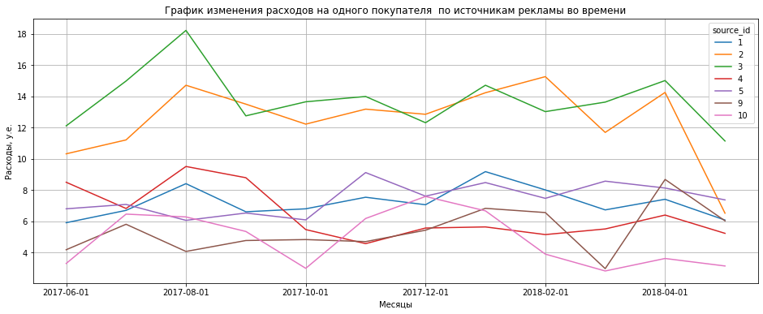


```python
report_cac_buy.loc[:, 'avg'].sort_values(ascending=False).plot(grid=True, kind='bar', figsize=(16,6))
plt.title('Средние расходы на одного покупателя  по источникам рекламы')
plt.ylabel('Расходы, у.е.')
plt.xlabel('Источники рекламы')
plt.xticks(rotation=1)
plt.show()
```


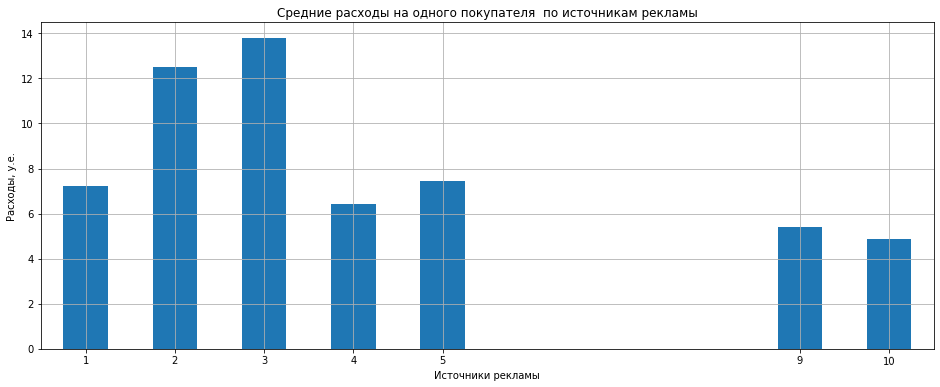


```python
# ПОСЕТИТЕЛИ
report_cac_ses = group_by_source_cac.pivot_table(index='source_id', columns='first_buy_m', values='cac_ses')
report_cac_ses['avg'] = round(report_cac_ses.mean(axis=1), 2)
report_cac_ses
```


<div>
<style scoped>
    .dataframe tbody tr th:only-of-type {
        vertical-align: middle;
    }

    .dataframe tbody tr th {
        vertical-align: top;
    }

    .dataframe thead th {
        text-align: right;
    }
</style>
<table border="1" class="dataframe">
  <thead>
    <tr style="text-align: right;">
      <th>first_buy_m</th>
      <th>2017-06-01</th>
      <th>2017-07-01</th>
      <th>2017-08-01</th>
      <th>2017-09-01</th>
      <th>2017-10-01</th>
      <th>2017-11-01</th>
      <th>2017-12-01</th>
      <th>2018-01-01</th>
      <th>2018-02-01</th>
      <th>2018-03-01</th>
      <th>2018-04-01</th>
      <th>2018-05-01</th>
      <th>avg</th>
    </tr>
    <tr>
      <th>source_id</th>
      <th></th>
      <th></th>
      <th></th>
      <th></th>
      <th></th>
      <th></th>
      <th></th>
      <th></th>
      <th></th>
      <th></th>
      <th></th>
      <th></th>
      <th></th>
    </tr>
  </thead>
  <tbody>
    <tr>
      <th>1</th>
      <td>1.16</td>
      <td>1.02</td>
      <td>1.20</td>
      <td>1.08</td>
      <td>1.07</td>
      <td>0.88</td>
      <td>0.86</td>
      <td>1.02</td>
      <td>1.04</td>
      <td>0.83</td>
      <td>0.82</td>
      <td>0.84</td>
      <td>0.98</td>
    </tr>
    <tr>
      <th>2</th>
      <td>1.58</td>
      <td>1.31</td>
      <td>1.42</td>
      <td>1.40</td>
      <td>1.45</td>
      <td>1.25</td>
      <td>1.32</td>
      <td>1.31</td>
      <td>1.42</td>
      <td>1.18</td>
      <td>1.24</td>
      <td>0.91</td>
      <td>1.32</td>
    </tr>
    <tr>
      <th>3</th>
      <td>1.83</td>
      <td>1.89</td>
      <td>1.80</td>
      <td>1.71</td>
      <td>1.84</td>
      <td>1.67</td>
      <td>1.76</td>
      <td>1.74</td>
      <td>1.64</td>
      <td>1.72</td>
      <td>1.70</td>
      <td>1.76</td>
      <td>1.76</td>
    </tr>
    <tr>
      <th>4</th>
      <td>0.97</td>
      <td>0.86</td>
      <td>1.03</td>
      <td>0.97</td>
      <td>0.67</td>
      <td>0.48</td>
      <td>0.65</td>
      <td>0.57</td>
      <td>0.59</td>
      <td>0.61</td>
      <td>0.60</td>
      <td>0.58</td>
      <td>0.72</td>
    </tr>
    <tr>
      <th>5</th>
      <td>0.90</td>
      <td>0.80</td>
      <td>0.69</td>
      <td>0.78</td>
      <td>0.77</td>
      <td>0.97</td>
      <td>0.94</td>
      <td>0.94</td>
      <td>0.85</td>
      <td>0.98</td>
      <td>0.71</td>
      <td>0.91</td>
      <td>0.85</td>
    </tr>
    <tr>
      <th>9</th>
      <td>0.38</td>
      <td>0.54</td>
      <td>0.41</td>
      <td>0.53</td>
      <td>0.58</td>
      <td>0.46</td>
      <td>0.53</td>
      <td>0.52</td>
      <td>0.53</td>
      <td>0.27</td>
      <td>0.50</td>
      <td>0.48</td>
      <td>0.48</td>
    </tr>
    <tr>
      <th>10</th>
      <td>0.74</td>
      <td>1.04</td>
      <td>0.95</td>
      <td>0.92</td>
      <td>0.68</td>
      <td>0.89</td>
      <td>1.04</td>
      <td>0.66</td>
      <td>0.44</td>
      <td>0.45</td>
      <td>0.64</td>
      <td>0.53</td>
      <td>0.75</td>
    </tr>
  </tbody>
</table>
</div>


```python
report_cac_ses.loc[:, '2017-06-01':'2018-05-01'].T.plot(grid=True, figsize=(16,6))
plt.title('График изменения расходов на одного посетителя по источникам рекламы во времени')
plt.ylabel('Расходы, у.е.')
plt.xlabel('Месяцы')
plt.show()
```


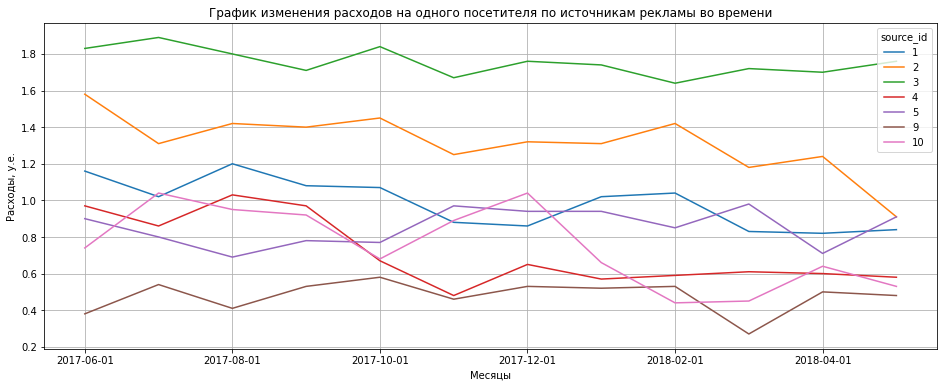


```python
report_cac_ses.loc[:, 'avg'].sort_values(ascending=False).plot(grid=True, kind='bar', figsize=(16,6))
plt.title('Средние расходы на одного посетителя по источникам рекламы')
plt.ylabel('Расходы, у.е.')
plt.xlabel('Источники рекламы')
plt.xticks(rotation=1)
plt.show()
```


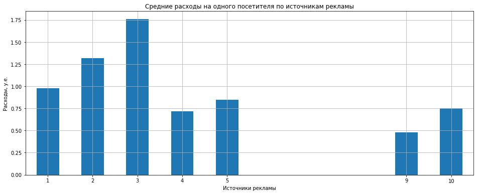


#### Выводы по  2.3.2.  <a name='step_2.3.2v'></a>
Источники рекламы имеют разные расходы и приносят сервису разное количество покупателей и средние расходы на одного покупателя имею разные значения.  
Наибольшая стоимость привлечения у источника 3 (у этого источника самые больше абсолютные расходы).  
Нименьшая стоимость привлечения у источника 10 (при этом у него самые низкие абсолютные расходы).  
Если рассматривать расходы в пересчете на посетители то в отношении источника 3 картина не меняется, а наименьшие расходы у источника 9 (это свидетельствует, что из для источника 9 конверсия в покупку хуже).

#### 2.3.3.  ROMI по когортам в разрезе источников<a name='step_2.3.3'></a>


```python
group_by_source.head()
```


<div>
<style scoped>
    .dataframe tbody tr th:only-of-type {
        vertical-align: middle;
    }

    .dataframe tbody tr th {
        vertical-align: top;
    }

    .dataframe thead th {
        text-align: right;
    }
</style>
<table border="1" class="dataframe">
  <thead>
    <tr style="text-align: right;">
      <th></th>
      <th>source_id</th>
      <th>first_buy_m</th>
      <th>lifetime</th>
      <th>sum_buy</th>
      <th>count_buy</th>
      <th>count_un_users_buy</th>
      <th>count_users_in_cohort</th>
      <th>cnt_un_users_ses</th>
      <th>costs</th>
      <th>cac_buy</th>
      <th>cac_ses</th>
    </tr>
  </thead>
  <tbody>
    <tr>
      <th>0</th>
      <td>1</td>
      <td>2017-06-01</td>
      <td>0</td>
      <td>1378.70</td>
      <td>268</td>
      <td>190</td>
      <td>190</td>
      <td>972</td>
      <td>1125.61</td>
      <td>5.92</td>
      <td>1.16</td>
    </tr>
    <tr>
      <th>1</th>
      <td>1</td>
      <td>2017-06-01</td>
      <td>1</td>
      <td>414.98</td>
      <td>80</td>
      <td>16</td>
      <td>190</td>
      <td>972</td>
      <td>1125.61</td>
      <td>5.92</td>
      <td>1.16</td>
    </tr>
    <tr>
      <th>2</th>
      <td>1</td>
      <td>2017-06-01</td>
      <td>2</td>
      <td>419.43</td>
      <td>87</td>
      <td>10</td>
      <td>190</td>
      <td>972</td>
      <td>1125.61</td>
      <td>5.92</td>
      <td>1.16</td>
    </tr>
    <tr>
      <th>3</th>
      <td>1</td>
      <td>2017-06-01</td>
      <td>3</td>
      <td>714.24</td>
      <td>119</td>
      <td>9</td>
      <td>190</td>
      <td>972</td>
      <td>1125.61</td>
      <td>5.92</td>
      <td>1.16</td>
    </tr>
    <tr>
      <th>4</th>
      <td>1</td>
      <td>2017-06-01</td>
      <td>4</td>
      <td>811.20</td>
      <td>114</td>
      <td>12</td>
      <td>190</td>
      <td>972</td>
      <td>1125.61</td>
      <td>5.92</td>
      <td>1.16</td>
    </tr>
  </tbody>
</table>
</div>


```python
# расчет LTV ROMI и добавление столбца в таблицу
group_by_source['ltv'] = group_by_source['sum_buy'] / group_by_source['count_users_in_cohort']
group_by_source['romi'] = group_by_source['ltv'] / group_by_source['cac_buy']
group_by_source
```


<div>
<style scoped>
    .dataframe tbody tr th:only-of-type {
        vertical-align: middle;
    }

    .dataframe tbody tr th {
        vertical-align: top;
    }

    .dataframe thead th {
        text-align: right;
    }
</style>
<table border="1" class="dataframe">
  <thead>
    <tr style="text-align: right;">
      <th></th>
      <th>source_id</th>
      <th>first_buy_m</th>
      <th>lifetime</th>
      <th>sum_buy</th>
      <th>count_buy</th>
      <th>count_un_users_buy</th>
      <th>count_users_in_cohort</th>
      <th>cnt_un_users_ses</th>
      <th>costs</th>
      <th>cac_buy</th>
      <th>cac_ses</th>
      <th>ltv</th>
      <th>romi</th>
    </tr>
  </thead>
  <tbody>
    <tr>
      <th>0</th>
      <td>1</td>
      <td>2017-06-01</td>
      <td>0</td>
      <td>1378.70</td>
      <td>268</td>
      <td>190</td>
      <td>190</td>
      <td>972</td>
      <td>1125.61</td>
      <td>5.92</td>
      <td>1.16</td>
      <td>7.256316</td>
      <td>1.225729</td>
    </tr>
    <tr>
      <th>1</th>
      <td>1</td>
      <td>2017-06-01</td>
      <td>1</td>
      <td>414.98</td>
      <td>80</td>
      <td>16</td>
      <td>190</td>
      <td>972</td>
      <td>1125.61</td>
      <td>5.92</td>
      <td>1.16</td>
      <td>2.184105</td>
      <td>0.368937</td>
    </tr>
    <tr>
      <th>2</th>
      <td>1</td>
      <td>2017-06-01</td>
      <td>2</td>
      <td>419.43</td>
      <td>87</td>
      <td>10</td>
      <td>190</td>
      <td>972</td>
      <td>1125.61</td>
      <td>5.92</td>
      <td>1.16</td>
      <td>2.207526</td>
      <td>0.372893</td>
    </tr>
    <tr>
      <th>3</th>
      <td>1</td>
      <td>2017-06-01</td>
      <td>3</td>
      <td>714.24</td>
      <td>119</td>
      <td>9</td>
      <td>190</td>
      <td>972</td>
      <td>1125.61</td>
      <td>5.92</td>
      <td>1.16</td>
      <td>3.759158</td>
      <td>0.634993</td>
    </tr>
    <tr>
      <th>4</th>
      <td>1</td>
      <td>2017-06-01</td>
      <td>4</td>
      <td>811.20</td>
      <td>114</td>
      <td>12</td>
      <td>190</td>
      <td>972</td>
      <td>1125.61</td>
      <td>5.92</td>
      <td>1.16</td>
      <td>4.269474</td>
      <td>0.721195</td>
    </tr>
    <tr>
      <th>...</th>
      <td>...</td>
      <td>...</td>
      <td>...</td>
      <td>...</td>
      <td>...</td>
      <td>...</td>
      <td>...</td>
      <td>...</td>
      <td>...</td>
      <td>...</td>
      <td>...</td>
      <td>...</td>
      <td>...</td>
    </tr>
    <tr>
      <th>509</th>
      <td>10</td>
      <td>2018-03-01</td>
      <td>0</td>
      <td>638.44</td>
      <td>218</td>
      <td>186</td>
      <td>186</td>
      <td>1167</td>
      <td>526.41</td>
      <td>2.83</td>
      <td>0.45</td>
      <td>3.432473</td>
      <td>1.212888</td>
    </tr>
    <tr>
      <th>510</th>
      <td>10</td>
      <td>2018-03-01</td>
      <td>1</td>
      <td>12.71</td>
      <td>5</td>
      <td>5</td>
      <td>186</td>
      <td>1167</td>
      <td>526.41</td>
      <td>2.83</td>
      <td>0.45</td>
      <td>0.068333</td>
      <td>0.024146</td>
    </tr>
    <tr>
      <th>511</th>
      <td>10</td>
      <td>2018-03-01</td>
      <td>2</td>
      <td>6.29</td>
      <td>3</td>
      <td>3</td>
      <td>186</td>
      <td>1167</td>
      <td>526.41</td>
      <td>2.83</td>
      <td>0.45</td>
      <td>0.033817</td>
      <td>0.011950</td>
    </tr>
    <tr>
      <th>512</th>
      <td>10</td>
      <td>2018-04-01</td>
      <td>0</td>
      <td>261.93</td>
      <td>112</td>
      <td>107</td>
      <td>107</td>
      <td>603</td>
      <td>388.25</td>
      <td>3.63</td>
      <td>0.64</td>
      <td>2.447944</td>
      <td>0.674365</td>
    </tr>
    <tr>
      <th>513</th>
      <td>10</td>
      <td>2018-05-01</td>
      <td>0</td>
      <td>470.89</td>
      <td>144</td>
      <td>130</td>
      <td>130</td>
      <td>777</td>
      <td>409.86</td>
      <td>3.15</td>
      <td>0.53</td>
      <td>3.622231</td>
      <td>1.149915</td>
    </tr>
  </tbody>
</table>
<p>514 rows × 13 columns</p>
</div>


```python
report_romi = (group_by_source.pivot_table(index=['source_id', 'first_buy_m'], columns='lifetime', values='romi')
               .cumsum(axis=1).round(2))
report_romi.head(15)
```


<div>
<style scoped>
    .dataframe tbody tr th:only-of-type {
        vertical-align: middle;
    }

    .dataframe tbody tr th {
        vertical-align: top;
    }

    .dataframe thead th {
        text-align: right;
    }
</style>
<table border="1" class="dataframe">
  <thead>
    <tr style="text-align: right;">
      <th></th>
      <th>lifetime</th>
      <th>0</th>
      <th>1</th>
      <th>2</th>
      <th>3</th>
      <th>4</th>
      <th>5</th>
      <th>6</th>
      <th>7</th>
      <th>8</th>
      <th>9</th>
      <th>10</th>
      <th>11</th>
    </tr>
    <tr>
      <th>source_id</th>
      <th>first_buy_m</th>
      <th></th>
      <th></th>
      <th></th>
      <th></th>
      <th></th>
      <th></th>
      <th></th>
      <th></th>
      <th></th>
      <th></th>
      <th></th>
      <th></th>
    </tr>
  </thead>
  <tbody>
    <tr>
      <th rowspan="12" valign="top">1</th>
      <th>2017-06-01</th>
      <td>1.23</td>
      <td>1.59</td>
      <td>1.97</td>
      <td>2.60</td>
      <td>3.32</td>
      <td>3.67</td>
      <td>4.11</td>
      <td>4.53</td>
      <td>4.92</td>
      <td>5.20</td>
      <td>5.40</td>
      <td>5.68</td>
    </tr>
    <tr>
      <th>2017-07-01</th>
      <td>1.09</td>
      <td>1.25</td>
      <td>2.05</td>
      <td>2.27</td>
      <td>2.40</td>
      <td>2.54</td>
      <td>2.60</td>
      <td>2.70</td>
      <td>2.83</td>
      <td>2.98</td>
      <td>3.11</td>
      <td>NaN</td>
    </tr>
    <tr>
      <th>2017-08-01</th>
      <td>0.89</td>
      <td>1.03</td>
      <td>1.15</td>
      <td>1.27</td>
      <td>1.39</td>
      <td>1.47</td>
      <td>1.55</td>
      <td>1.87</td>
      <td>2.13</td>
      <td>2.22</td>
      <td>NaN</td>
      <td>NaN</td>
    </tr>
    <tr>
      <th>2017-09-01</th>
      <td>0.91</td>
      <td>1.18</td>
      <td>1.27</td>
      <td>1.40</td>
      <td>1.41</td>
      <td>1.43</td>
      <td>1.44</td>
      <td>1.48</td>
      <td>1.57</td>
      <td>NaN</td>
      <td>NaN</td>
      <td>NaN</td>
    </tr>
    <tr>
      <th>2017-10-01</th>
      <td>0.88</td>
      <td>1.04</td>
      <td>1.07</td>
      <td>1.13</td>
      <td>1.14</td>
      <td>1.16</td>
      <td>1.18</td>
      <td>1.23</td>
      <td>NaN</td>
      <td>NaN</td>
      <td>NaN</td>
      <td>NaN</td>
    </tr>
    <tr>
      <th>2017-11-01</th>
      <td>0.98</td>
      <td>1.05</td>
      <td>1.18</td>
      <td>1.30</td>
      <td>1.32</td>
      <td>1.34</td>
      <td>1.35</td>
      <td>NaN</td>
      <td>NaN</td>
      <td>NaN</td>
      <td>NaN</td>
      <td>NaN</td>
    </tr>
    <tr>
      <th>2017-12-01</th>
      <td>0.65</td>
      <td>0.69</td>
      <td>0.73</td>
      <td>0.77</td>
      <td>0.77</td>
      <td>0.79</td>
      <td>NaN</td>
      <td>NaN</td>
      <td>NaN</td>
      <td>NaN</td>
      <td>NaN</td>
      <td>NaN</td>
    </tr>
    <tr>
      <th>2018-01-01</th>
      <td>0.63</td>
      <td>0.64</td>
      <td>0.65</td>
      <td>0.76</td>
      <td>0.76</td>
      <td>NaN</td>
      <td>NaN</td>
      <td>NaN</td>
      <td>NaN</td>
      <td>NaN</td>
      <td>NaN</td>
      <td>NaN</td>
    </tr>
    <tr>
      <th>2018-02-01</th>
      <td>0.58</td>
      <td>0.71</td>
      <td>0.72</td>
      <td>0.76</td>
      <td>NaN</td>
      <td>NaN</td>
      <td>NaN</td>
      <td>NaN</td>
      <td>NaN</td>
      <td>NaN</td>
      <td>NaN</td>
      <td>NaN</td>
    </tr>
    <tr>
      <th>2018-03-01</th>
      <td>1.39</td>
      <td>1.67</td>
      <td>1.79</td>
      <td>NaN</td>
      <td>NaN</td>
      <td>NaN</td>
      <td>NaN</td>
      <td>NaN</td>
      <td>NaN</td>
      <td>NaN</td>
      <td>NaN</td>
      <td>NaN</td>
    </tr>
    <tr>
      <th>2018-04-01</th>
      <td>0.63</td>
      <td>0.67</td>
      <td>NaN</td>
      <td>NaN</td>
      <td>NaN</td>
      <td>NaN</td>
      <td>NaN</td>
      <td>NaN</td>
      <td>NaN</td>
      <td>NaN</td>
      <td>NaN</td>
      <td>NaN</td>
    </tr>
    <tr>
      <th>2018-05-01</th>
      <td>0.86</td>
      <td>NaN</td>
      <td>NaN</td>
      <td>NaN</td>
      <td>NaN</td>
      <td>NaN</td>
      <td>NaN</td>
      <td>NaN</td>
      <td>NaN</td>
      <td>NaN</td>
      <td>NaN</td>
      <td>NaN</td>
    </tr>
    <tr>
      <th rowspan="3" valign="top">2</th>
      <th>2017-06-01</th>
      <td>0.43</td>
      <td>0.48</td>
      <td>0.50</td>
      <td>0.69</td>
      <td>0.85</td>
      <td>0.94</td>
      <td>1.10</td>
      <td>1.24</td>
      <td>1.37</td>
      <td>1.44</td>
      <td>1.57</td>
      <td>1.61</td>
    </tr>
    <tr>
      <th>2017-07-01</th>
      <td>0.75</td>
      <td>0.82</td>
      <td>0.82</td>
      <td>0.85</td>
      <td>0.89</td>
      <td>0.91</td>
      <td>0.94</td>
      <td>0.95</td>
      <td>0.96</td>
      <td>0.98</td>
      <td>1.01</td>
      <td>NaN</td>
    </tr>
    <tr>
      <th>2017-08-01</th>
      <td>0.39</td>
      <td>0.45</td>
      <td>0.47</td>
      <td>0.48</td>
      <td>0.52</td>
      <td>0.52</td>
      <td>0.53</td>
      <td>0.56</td>
      <td>0.56</td>
      <td>0.56</td>
      <td>NaN</td>
      <td>NaN</td>
    </tr>
  </tbody>
</table>
</div>


```python
source_num = report_romi.index.get_level_values(0).unique()
```


```python
# определение функции для построения когортного анализа в разрезе источников
def cohort_plot_source(num):
    plt.figure(figsize=(12,4), dpi=200)
    sns.heatmap(report_romi.loc[num], annot=True, fmt='.2f', linewidths=1, linecolor='gray')
    plt.title('ROMI по когортам для источника %s' % num)
    plt.ylabel('Когорта ')
    plt.xlabel('Время жизни когорты, мес.')
    plt.show()
```


```python
for num in source_num:
    cohort_plot_source(num)
```


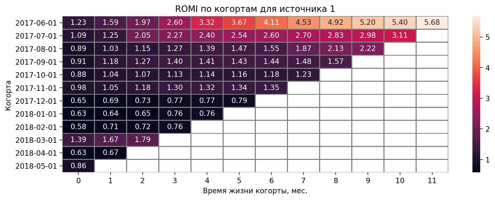


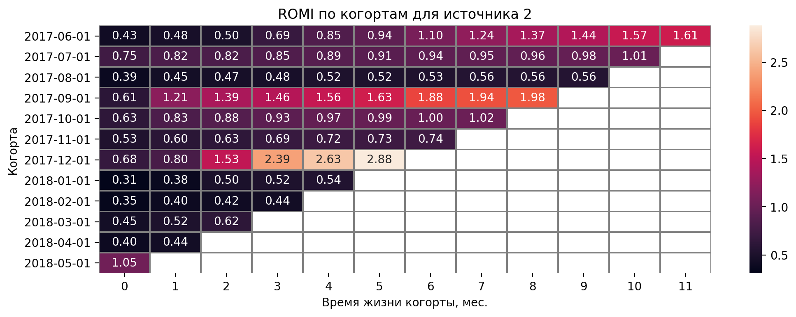


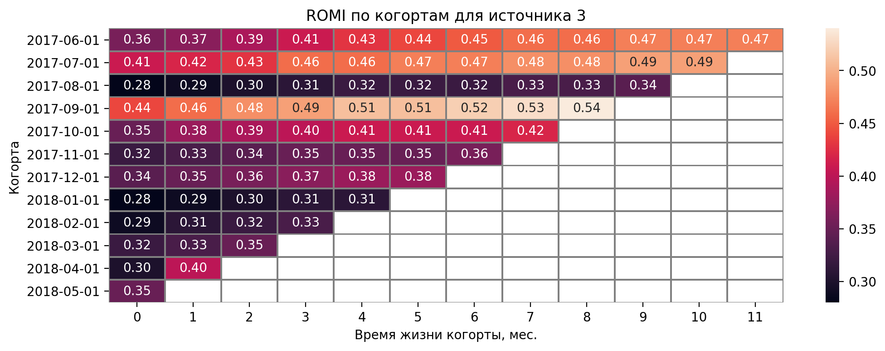


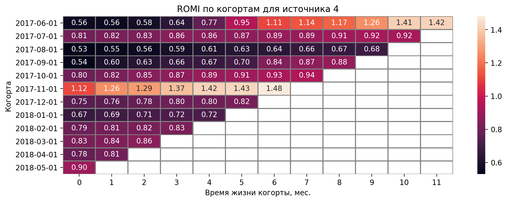


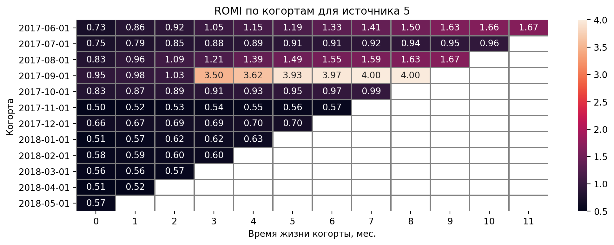


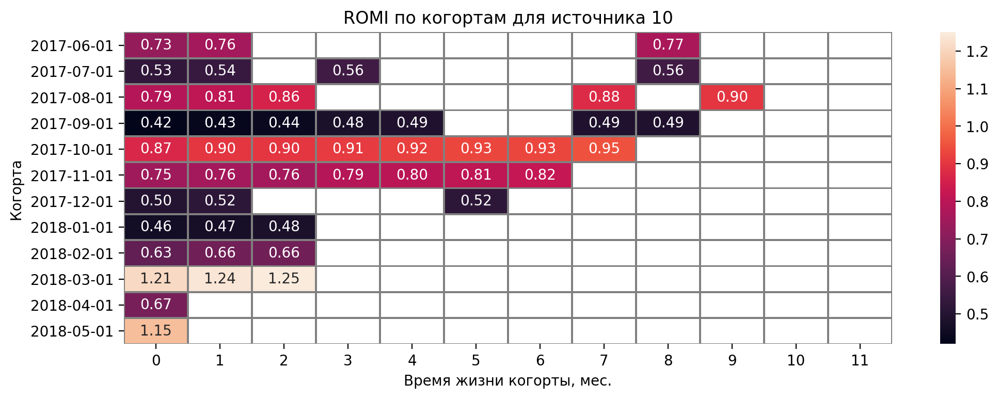


```python
# проверка данных по источнику 10
data_source_ten = group_by_source[group_by_source['source_id'] == 10][['first_buy_m', 'lifetime', 'sum_buy', 'count_buy']]
gr_source_ten_sum = data_source_ten.pivot_table(index='first_buy_m', columns='lifetime', values='sum_buy')
plt.figure(figsize=(10,3), dpi=100)
sns.heatmap(gr_source_ten_sum, annot=True, fmt='.2f', linewidths=1, linecolor='gray')
plt.title('Сумма продаж по когортам для источника 10')
plt.ylabel('Когорта ')
plt.xlabel('Время жизни когорты, мес.')
plt.show()
```


##### Пропуски на графике ROMI по когортам для источника 10 объясняются отсутствием продаж в данные периоды времени


```python
# определим функция для вывода средней окупаемости (ROMI) для каждого источника за 6 месяцев
range_month=['2017-06-01', '2017-07-01','2017-08-01', '2017-09-01', '2017-10-01', '2017-11-01', '2017-12-01']
def source_romi_six_month(num):
    plt.figure(figsize=(0.5, 0.5), dpi=100)
    sns.heatmap(report_romi.loc[(num, range_month), 5]
                .to_frame().mean().to_frame(),  cbar=False, cmap='hsv', annot=True, fmt='.2f')
    plt.title('Средняя окупаемость (ROMI) для источника %s за 6 месяцев' % num)
    plt.xticks(ticks=[], lable='')
    plt.yticks(ticks=[], lable='')
    plt.show()
```


```python
for num in source_num:
    source_romi_six_month(num)
```


#### Выводы по  2.3.3.  <a name='step_2.3.3v'></a>  
* Среднюю окупаемость больше 1.0 за 6 месяцев имеют источники 1, 2, 5 и 9  (наилучший показетель 1.77  у источника 1);
* Среднюю окупаемость меньше 1.0 за 6 месяцев имеют источники 3, 4 и 10 (наихудший показетель 0.41  у источника 3).

#### 2.3.4.  Анализ заказов пользователей в разрезе устройств и платформ  <a name='step_2.3.4'></a>


```python
group_by_device_source = (df_o[df_o['lifetime'] == 0].groupby(['source_id', 'device', 'first_buy_m'])
                 .agg({'uid': 'nunique'}))
group_by_device_source = group_by_device_source.rename(columns={'uid': 'count_users_in_cohort'})
group_by_device_source.head()
```


<div>
<style scoped>
    .dataframe tbody tr th:only-of-type {
        vertical-align: middle;
    }

    .dataframe tbody tr th {
        vertical-align: top;
    }

    .dataframe thead th {
        text-align: right;
    }
</style>
<table border="1" class="dataframe">
  <thead>
    <tr style="text-align: right;">
      <th></th>
      <th></th>
      <th></th>
      <th>count_users_in_cohort</th>
    </tr>
    <tr>
      <th>source_id</th>
      <th>device</th>
      <th>first_buy_m</th>
      <th></th>
    </tr>
  </thead>
  <tbody>
    <tr>
      <th rowspan="5" valign="top">1</th>
      <th rowspan="5" valign="top">desktop</th>
      <th>2017-06-01</th>
      <td>163</td>
    </tr>
    <tr>
      <th>2017-07-01</th>
      <td>138</td>
    </tr>
    <tr>
      <th>2017-08-01</th>
      <td>94</td>
    </tr>
    <tr>
      <th>2017-09-01</th>
      <td>181</td>
    </tr>
    <tr>
      <th>2017-10-01</th>
      <td>272</td>
    </tr>
  </tbody>
</table>
</div>


```python
# определим функцию для вывода графиков количества пользователей когорт по источникам и платформам
def plot_desktop_touch_users(num):
    ax=group_by_device_source.loc[(num, 'desktop'), :].plot(grid=True, figsize=(12,6))
    group_by_device_source.loc[(1, 'touch'), :].plot(grid=True, ax=ax)
    plt.legend(('desktop', 'touch'))
    plt.xlabel('')
    plt.ylabel('Количество покупателей, шт.')
    plt.title('Количество покупателей в когортах по платформам для источника %s' % num)
    plt.show()
```


```python
for num in source_num:
    plot_desktop_touch_users(num)
```


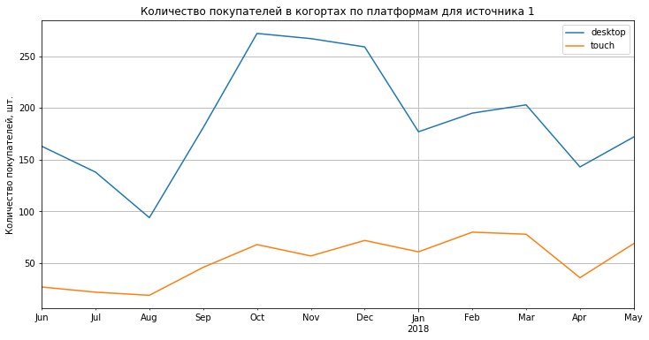


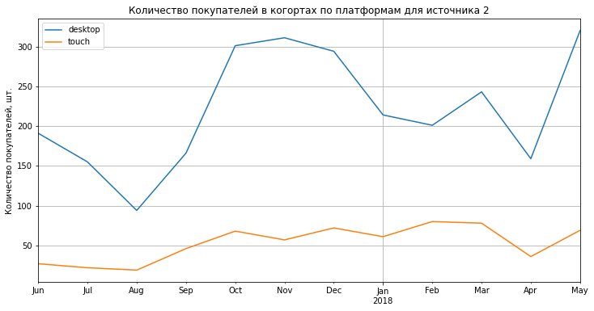


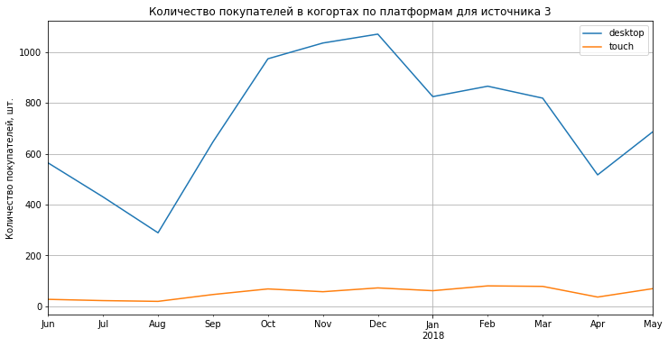


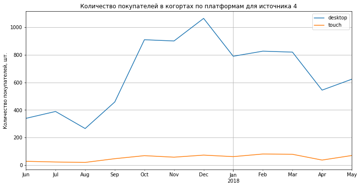


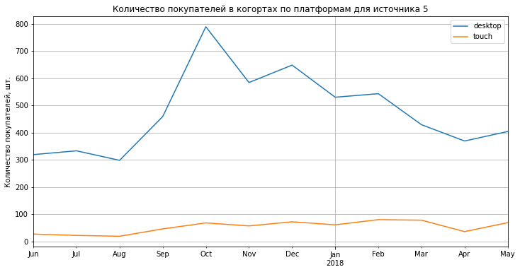


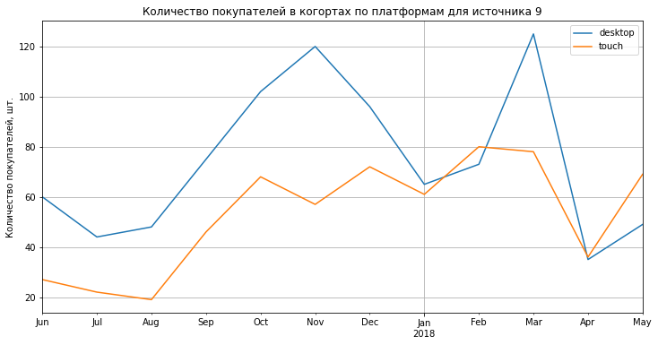


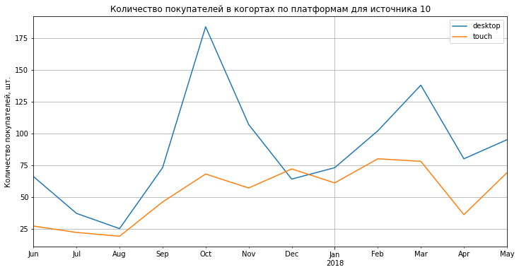


[Оглавление](#step_0)
## Общие выводы по исследованию <a name='step_fin'></a>

* Исследование показала, что наибольшее количество покупателей приносит desktop платформа, по сравнению с touch платформой. Данное превосходство наблюдается по всех источникам рекламы, при этом на источниках рекламы 9 и 10 в ряде месяцев показатели по количеству покупателей платформ сравниваются.  
* Что касается показателя ROMI в разрезе источников, то за 6 месяцев среднюю окупаемость больше 1.0 достигли источники 1, 2, 5 и 9 (у источника 1 - наилучший показетель 1.77 среди остальных), а  среднюю окупаемость меньше 1.0 за 6 месяцев имеют источники 3, 4 и 10 (у источника 3 наихудший показетель - 0.41). Маркетологам стоит обратить внимание на источник 3, поскольку он съедает большую часть бюджета и не дает возврата инвестиций.
* Маркетиновая метрика ROMI показалa, в разрезе источников рекламы, какие из них окупают вложенные инвестиции , а какие нет. На основании этой метрики необходимо пересмотреть рекламный бюджет с учетом указанных рекомендаций.
* Продуктовые метрики показали, что пользователи заходят на сайт в первый месяц своего обращения, а дальше возвращаемость очень низкая и продажи обеспечиваются за счет новых покупателей.
* Метрики электронной коммерции подтвердили значения продуктовых метрик о том, что пользователи сервиса осуществляют покупку в первый месяц, а дальнейшие покупки очень редки. При этом показатель среднего чека по мере увеличения возраста когорты растет. Т.е. общий объем продаж от старых покупателей очень низок, а средний чек одного покупателя растет (в сервисе остаются только самые "преданные").
* Когортный анализ покупателей показал, что по мере появления новых когорт покупателей их показатели снижаются, т.е. снижается средняя выручка с пользователя в первый месяц и угасание средней выручки с пользователя для новых когорт происходит быстрее. В связи с этим,  наиболее перспективными для компании являются старые когорты клиентов.
* В целом необходим  более глубокий анализ причин очень низкой возвращаемости клиентов, в связи с чем выручка формируется за счет новых покупателей. Таким образом,  в компании не наблюдается эффекта коммулятивного роста клиенской базы активных(покупающих) клиентов.
